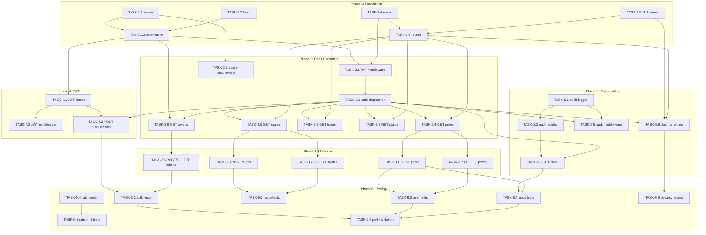

# Tasks: Remote Control Plane API

**Input**: Design documents from `specs/002-api-control-plane/` (spec.md, plan.md, data-model.md, contracts/)
**Prerequisites**: plan.md (required), spec.md (required), data-model.md (required), contracts/api.openapi.yaml (required), contracts/auth-flows.md (required)
**Version**: 1
**Last Updated**: 2026-05-27

**Organization**: Tasks grouped by execution phase. Each task is assigned to a specialist agent. Phases unlock sequentially; tasks within a phase marked `[P]` can run in parallel.

**Dependency Summary**: Foundation (auth primitives) → Read endpoints → Mutations → JWT session → Cross-cutting (audit, rate-limit) → Integration tests.

---

## Phase 1: Foundation (Auth + Token Store + TLS Server)

**Purpose**: Core primitives every downstream phase depends on. Token store, bcrypt hashing, scope enum, TLS listener, error response helpers. No endpoints yet.

- [ ] TASK-1.1 [backend-specialist] [P] Implement scope enum and permission hierarchy in `internal/auth/scope.go`
  - Define `Scope` type (`read`, `write`, `admin`), `Allows(required Scope) bool` method. `admin ⊃ write ⊃ read`.
  - **Deps**: none
  - **Acceptance**:
    - `admin.Allows(write)` → true, `read.Allows(write)` → false
    - Table-driven tests cover all 9 combinations
    - Zero external dependencies
  - **LOC**: ~60
  - **Maps to**: data-model.md Scope enum, plan.md §Component 2 (scope enforcement)

- [ ] TASK-1.2 [backend-specialist] [P] Implement bcrypt hash + verify with constant-time compare in `internal/auth/hash.go`
  - `HashToken(plain string) (hash string, err error)` — cost 12. `VerifyToken(plain, hash string) bool`.
  - **Deps**: none
  - **Acceptance**:
    - Round-trip: hash then verify returns true
    - Wrong token returns false
    - Cost 12 benchmark < 500ms on test machine
    - No plaintext in error messages or logs
  - **LOC**: ~50
  - **Maps to**: FR-002, data-model.md APIToken.tokenHash

- [ ] TASK-1.3 [backend-specialist] Implement token store CRUD (file-backed JSON in config.json) in `internal/auth/store.go` and `internal/auth/token.go`
  - Token struct (matches data-model.md APIToken). CRUD: Create, GetByID, GetByName, List, Update, SoftDelete. Persist to `apiTokens[]` in `~/.unet/config.json`. Atomic write via temp+rename. File mode 0600.
  - Token creation: 32 random bytes → base64url → prefix `unet_` → bcrypt hash → store. Return plaintext once.
  - **Deps**: TASK-1.1 (scope type), TASK-1.2 (hash functions)
  - **Acceptance**:
    - Create token → plaintext returned once; `tokenHash` stored, never returned in List/Get
    - `tokenPrefix` = first 8 chars of raw token
    - Name uniqueness enforced (409 on duplicate)
    - `expiresAt` validation: reject past dates
    - Soft-disable via `enabled=false` (revoke without delete)
    - `lastUsedAt` and `requestCount` updatable independently
    - All tests use `t.TempDir()`, no real `~/.unet`
  - **LOC**: ~350
  - **Maps to**: FR-002, FR-003, data-model.md APIToken, plan.md §Component 3

- [ ] TASK-1.4 [backend-specialist] [P] Implement structured error response helpers in `internal/api/v1/errors.go`
  - `ErrorResponse(w, status, code, message string, context map[string]any)`. All errors follow `{ "error": "snake_case", "message": "...", "context": {...} }`. Helper constants for common codes: `unauthorized`, `forbidden_scope`, `not_found`, `peer_name_conflict`, `route_conflict`, `tunnel_not_connected`, `ip_pool_exhausted`, `vps_unreachable`, `rate_limited`.
  - **Deps**: none
  - **Acceptance**:
    - Every error response has exactly the 3 required fields
    - `error` field is always snake_case
    - HTTP status codes are semantically correct per FR-014
    - Table-driven tests for all error constants
  - **LOC**: ~120
  - **Maps to**: FR-014, plan.md §Component 5

- [ ] TASK-1.5 [backend-specialist] Implement TLS listener bootstrap (self-signed cert gen + configurable cert loading) in `internal/api/remote/server.go` and `internal/api/remote/tls.go`
  - On first start: generate ECDSA P-256 cert, 365-day validity, store at `~/.unet/cert.pem` + `~/.unet/key.pem`. Admin can replace with CA-signed cert. Refuse to start on non-loopback without TLS. Configurable listen address (default `0.0.0.0:8443`). Read `remoteApi` from config.json.
  - **Deps**: none (parallel with 1.1-1.4, but needed before Phase 2)
  - **Acceptance**:
    - Self-signed cert generated on first run; reused on subsequent starts
    - TLS handshake succeeds with generated cert
    - Server refuses non-TLS on non-loopback bind address
    - `127.0.0.1:8443` bind skips TLS requirement (dev mode)
    - `remoteApi.listenAddr` configurable from config.json
  - **LOC**: ~250
  - **Maps to**: FR-012, FR-013, plan.md §Component 1

- [ ] TASK-1.6 [backend-specialist] Implement mux registration and middleware chain for `/v1/*` routes in `internal/api/remote/routes.go` and `internal/api/v1/handlers.go`
  - Register all `/v1/` paths (peers, routes, tunnel, tokens, audit, status, auth/session) on `http.ServeMux`. Mount middleware chain: auth-by-bind-address → PAT/JWT validation → scope enforcement → rate limiter → audit logger. Placeholder handlers returning 501 for Phase 2/3/4/5 fill-in.
  - **Deps**: TASK-1.4 (error helpers), TASK-1.5 (server)
  - **Acceptance**:
    - All 14 OpenAPI paths registered (including parameterized peers/{id}, routes/{id}, tokens/{id})
    - Unregistered paths return 404 with structured error
    - Middleware chain is correctly ordered
    - Placeholder handlers return `501 not_implemented`
  - **LOC**: ~200
  - **Maps to**: plan.md §Component 2 + §Component 5, api.openapi.yaml all paths

**Checkpoint**: Auth primitives, TLS server, route registry all in place. Middleware chain mounts but endpoints return 501.

---

## Phase 2: Endpoints — Read-Only (P1)

**Purpose**: P1 read endpoints. All read-only, no side effects. Depends on Phase 1 auth + middleware being functional.

- [ ] TASK-2.1 [backend-specialist] [P] Implement PAT validation middleware in `internal/api/middleware/pat.go`
  - Extract `Authorization: Bearer *** If starts with `unet_` → PAT flow: check in-memory LRU cache (5-min TTL) → on miss, bcrypt-verify against all stored hashes. Inject `{ tokenID, tokenName, scope }` into request context. Update `lastUsedAt` + `requestCount`. Invalidate cache on token revocation.
  - **Deps**: TASK-1.3 (token store), TASK-1.4 (error helpers)
  - **Acceptance**:
    - Valid PAT → context populated with token metadata
    - Invalid PAT → 401 with structured error
    - Revoked PAT → 401 (cache invalidated, bcrypt miss)
    - Expired PAT → 401
    - Cache hit path: no bcrypt call (latency < 1ms)
    - Cache miss path: bcrypt verify completes
    - `lastUsedAt` and `requestCount` updated after successful auth
  - **LOC**: ~200
  - **Maps to**: FR-001, FR-002, plan.md §Component 2, auth-flows.md §2

- [ ] TASK-2.2 [backend-specialist] [P] Implement scope enforcement middleware in `internal/api/middleware/scope.go`
  - Read scope from context (set by PAT or JWT middleware). Compare against endpoint's required scope. Return 403 with `required_scope` and `actual_scope` in error context if insufficient. Use `admin ⊃ write ⊃ read` hierarchy.
  - **Deps**: TASK-1.1 (scope type)
  - **Acceptance**:
    - `read` token → GET peers → 200
    - `read` token → POST peers → 403
    - `write` token → POST peers → 200
    - `write` token → POST tokens → 403
    - `admin` token → POST tokens → 200
    - Error response includes `required_scope` and `actual_scope` in context
  - **LOC**: ~100
  - **Maps to**: FR-003, plan.md §Component 2, auth-flows.md §2

- [ ] TASK-2.3 [backend-specialist] [P] Implement auth-by-bind-address dispatcher middleware in `internal/api/middleware/auth.go`
  - Inspect `r.RemoteAddr`. Loopback (127.0.0.1, ::1) → skip auth, inject `{ source: "localhost", scope: "admin" }`. Network → proceed to PAT/JWT extraction. If no `Authorization` header → 401. Dispatch to PAT or JWT flow based on token prefix (`unet_` vs `eyJ`).
  - **Deps**: TASK-2.1 (PAT middleware)
  - **Acceptance**:
    - Request from 127.0.0.1 → auth skipped, admin scope injected
    - Request from external IP, no Bearer → 401
    - Request from external IP, PAT `unet_*` → PAT validation runs
    - Request from external IP, JWT `eyJ*` → JWT validation runs (Task-4.1)
    - Request from external IP, unknown prefix → 401
  - **LOC**: ~100
  - **Maps to**: plan.md §Component 2, auth-flows.md §5

- [ ] TASK-2.4 [backend-specialist] Implement `GET /v1/peers` and `GET /v1/peers/:id` in `internal/api/v1/peers.go`
  - List peers: read from daemon's existing peer structures + `clientsTable`. Derive `connected` from `awg show` handshake recency (< 3 min). Return JSON array (list) or single object (detail). Detail includes `lastHandshake`, `transferRx`, `transferTx`. Requires `read` scope.
  - **Deps**: TASK-1.6 (route registration), TASK-2.3 (auth middleware)
  - **Acceptance**:
    - `GET /v1/peers` → 200, JSON array of Peer objects
    - `GET /v1/peers/:id` → 200, PeerDetail with stats
    - `GET /v1/peers/:id` → 404 for unknown ID
    - `connected` derived from handshake recency
    - No secret material leaked (no private keys)
    - Daemon core functions called via interface (mockable)
  - **LOC**: ~200
  - **Maps to**: FR-004, FR-006, US1, US3

- [ ] TASK-2.5 [backend-specialist] [P] Implement `GET /v1/routes` in `internal/api/v1/routes.go`
  - List ingress routes: read from daemon's existing `exposedPorts[]`. Map fields per data-model.md IngressRoute. Requires `read` scope.
  - **Deps**: TASK-1.6 (route registration), TASK-2.3 (auth middleware)
  - **Acceptance**:
    - Returns JSON array of IngressRoute objects
    - Each route has: id, subdomain, localPort, status, fqdn, createdAt
    - Empty array (200) when no routes exist
    - Reads from existing `exposedPorts[]` — no separate store
  - **LOC**: ~120
  - **Maps to**: FR-008, US3

- [ ] TASK-2.6 [backend-specialist] [P] Implement `GET /v1/tunnel/status` in `internal/api/v1/tunnel.go`
  - Return tunnel status: `connected`/`disconnected`/`connecting`/`error`, local IP, server IP, server endpoint, connectedAt. If VPS unreachable, return cached data with `stale: true`. Requires `read` scope.
  - **Deps**: TASK-1.6 (route registration), TASK-2.3 (auth middleware)
  - **Acceptance**:
    - Connected → 200 with all fields populated
    - Disconnected → 200 with `status: "disconnected"` (not an error)
    - VPS unreachable → 200 with `stale: true`
    - Daemon core tunnel status called via interface
  - **LOC**: ~100
  - **Maps to**: FR-011, US3

- [ ] TASK-2.7 [backend-specialist] [P] Implement `GET /v1/status` in `internal/api/v1/status.go`
  - System health: API version, tunnel summary, peer counts, route counts, TLS cert expiry (warning if < 30 days), VPS reachability. Aggregates data from tunnel status, peer list, route list, TLS cert inspection.
  - **Deps**: TASK-1.6 (route registration), TASK-2.3 (auth middleware)
  - **Acceptance**:
    - Returns SystemStatus matching api.openapi.yaml schema
    - `tls.certExpiryWarning` = true when cert expires within 30 days
    - `vps.status` reflects reachability
    - `apiVersion` = `2026-05-27`
  - **LOC**: ~150
  - **Maps to**: FR-012, US3

- [ ] TASK-2.8 [backend-specialist] [P] Implement `GET /v1/tokens` in `internal/api/v1/tokens.go`
  - List all API tokens (metadata only — never return `tokenHash` or plaintext). Requires `admin` scope. Returns TokenInfo array per api.openapi.yaml.
  - **Deps**: TASK-1.3 (token store), TASK-1.6 (route registration), TASK-2.3 (auth middleware)
  - **Acceptance**:
    - Returns array of TokenInfo (id, name, tokenPrefix, scope, createdBy, createdAt, expiresAt, lastUsedAt, requestCount, enabled)
    - `tokenHash` field NEVER appears in response
    - Plaintext NEVER appears in response
    - Requires `admin` scope — 403 for lower scopes
  - **LOC**: ~80
  - **Maps to**: FR-003, US5

**Checkpoint**: All P1 read endpoints functional. External tool can authenticate + list peers, routes, tunnel status, system status, tokens.

---

## Phase 3: Endpoints — Mutations (P1 + P2 Write Operations)

**Purpose**: State-changing endpoints. Peer CRUD, route CRUD, token management. Depends on read endpoints (reuses auth + handler patterns).

- [ ] TASK-3.1 [backend-specialist] Implement `POST /v1/peers` in `internal/api/v1/peers.go`
  - Create peer: validate name (1–64 chars, `[a-zA-Z0-9_-]`), allocate next IP in tunnel subnet, generate WireGuard keypair via `awg genkey`/`awg pubkey`, add `[Peer]` to server `awg0.conf` via SSH, run `awg syncconf`, return full WireGuard client config including AmneziaWG obfuscation params. Requires `write` scope. Serialize writes via daemon's existing mutex. IP exhaustion → 507. Name conflict → 409. VPS unreachable → 503.
  - **Deps**: TASK-2.4 (peer read handlers)
  - **Acceptance**:
    - Valid request → 201 with Peer + `clientConfig` (full `.conf` content)
    - Duplicate name → 409 `peer_name_conflict`
    - IP pool exhausted → 507 `ip_pool_exhausted`
    - VPS unreachable → 503 `vps_unreachable`
    - Concurrent requests (5 simultaneous) → no corruption, no duplicate IPs
    - Mutex held across entire alloc+write+sync sequence
    - `createdVia: "api"` set on new peer
  - **LOC**: ~300
  - **Maps to**: FR-005, US2, spec.md Edge Cases (concurrent peer creation, IP exhaustion)

- [ ] TASK-3.2 [backend-specialist] Implement `DELETE /v1/peers/:id` in `internal/api/v1/peers.go`
  - Remove peer from `awg0.conf`, run `awg syncconf`, terminate WireGuard connection. Requires `write` scope. 404 for unknown ID.
  - **Deps**: TASK-2.4 (peer read handlers)
  - **Acceptance**:
    - Existing peer → 200 `{ id, status: "removed" }`
    - Unknown ID → 404
    - Peer WireGuard connection immediately terminated
    - Mutex held during config modification
  - **LOC**: ~120
  - **Maps to**: FR-007, US2

- [ ] TASK-3.3 [backend-specialist] [P] Implement `POST /v1/routes` in `internal/api/v1/routes.go`
  - Create ingress route: validate subdomain (RFC 1035, single-label in cloudflare mode), validate port (1–65535), check tunnel connected (412 if not), check subdomain uniqueness (409), create Caddy route + DNS record (if cloudflare mode). Requires `write` scope.
  - **Deps**: TASK-2.5 (route read handler)
  - **Acceptance**:
    - Valid request → 201 with IngressRoute object
    - Duplicate subdomain → 409 `route_conflict`
    - No active tunnel → 412 `tunnel_not_connected`
    - Invalid subdomain → 400 with validation error
    - Caddy config updated within 2 seconds
  - **LOC**: ~250
  - **Maps to**: FR-009, US4

- [ ] TASK-3.4 [backend-specialist] [P] Implement `DELETE /v1/routes/:id` in `internal/api/v1/routes.go`
  - Remove Caddy route + DNS record. Requires `write` scope. 404 for unknown ID.
  - **Deps**: TASK-2.5 (route read handler)
  - **Acceptance**:
    - Existing route → 200 `{ id, status: "removed" }`
    - Unknown ID → 404
    - Caddy route removed
    - DNS record removed (if cloudflare mode)
  - **LOC**: ~100
  - **Maps to**: FR-010, US4

- [ ] TASK-3.5 [backend-specialist] Implement `POST /v1/tokens` and `DELETE /v1/tokens/:id` in `internal/api/v1/tokens.go`
  - Create: validate name + scope + optional expiresAt, generate PAT, store hash, return plaintext once. Revoke: soft-disable (`enabled=false`), invalidate cache, audit. Both require `admin` scope. Bootstrap token flow: first daemon start with empty `apiTokens` → generate `bootstrap-admin` PAT, write to `~/.unet/bootstrap-token` (mode 0600), delete file after first successful token creation.
  - **Deps**: TASK-2.8 (token list), TASK-1.3 (token store)
  - **Acceptance**:
    - `POST /v1/tokens` → 201, plaintext in response, hash stored
    - Plaintext NEVER returned again by any endpoint
    - `DELETE /v1/tokens/:id` → 200, `status: "revoked"`
    - Cache invalidated on revoke
    - Bootstrap token auto-generated on empty store
    - Bootstrap file deleted after first real token created
    - Audit entry written for both create and revoke
  - **LOC**: ~250
  - **Maps to**: FR-003, US5, auth-flows.md §1 (bootstrap)

**Checkpoint**: All mutation endpoints functional. Full CRUD on peers, routes, tokens. Bootstrap flow works.

---

## Phase 4: JWT Session Flow (P1 — Admin UI Auth)

**Purpose**: JWT issue, validation, refresh. Enables browser-based admin UI sessions.

- [ ] TASK-4.1 [backend-specialist] Implement JWT issuer and validator in `internal/auth/jwt.go`
  - HS256 signing with key derived from daemon config secret. Claims: sub (token ID), name, scope, iss (`unet-daemon`), iat, exp (15 min default), jti (UUID). Issue, validate, extract claims. Key generation: if `daemon.jwtSigningKey` missing → generate 32 random bytes → persist base64-encoded to config.json.
  - **Deps**: TASK-1.3 (token store — for PAT existence check during JWT validation)
  - **Acceptance**:
    - Issue JWT → valid token with correct claims
    - Validate JWT → claims extracted correctly
    - Expired JWT → validation fails
    - Wrong signing key → validation fails
    - Wrong issuer → validation fails
    - Key auto-generated on first use if missing
  - **LOC**: ~200
  - **Maps to**: data-model.md Session, plan.md §Component 3 (JWT)

- [ ] TASK-4.2 [backend-specialist] Implement JWT validation middleware in `internal/api/middleware/jwt.go`
  - Parse token, verify HS256 signature, check exp, check iss, extract claims. Verify referenced PAT still exists and is enabled (if PAT revoked → JWT invalid despite not expired). Inject `{ sessionID, tokenScope, tokenName, parentTokenID }` into context.
  - **Deps**: TASK-4.1 (JWT issuer), TASK-1.3 (token store)
  - **Acceptance**:
    - Valid JWT → context populated with session metadata
    - Expired JWT → 401
    - JWT referencing revoked PAT → 401
    - JWT referencing deleted PAT → 401
    - Malformed JWT → 401
  - **LOC**: ~120
  - **Maps to**: auth-flows.md §3 (JWT validation)

- [ ] TASK-4.3 [backend-specialist] Implement `POST /v1/auth/session` in `internal/api/v1/auth.go`
  - Exchange PAT for JWT: validate PAT (must be `read` scope minimum), extract scope/name, issue JWT. PAT cannot be used to self-refresh (no JWT→JWT). Response: `{ token, expiresIn, scope }`.
  - **Deps**: TASK-4.1 (JWT issuer), TASK-2.3 (auth middleware)
  - **Acceptance**:
    - Valid PAT → 200 with JWT + expiresIn + scope
    - Invalid PAT → 401
    - JWT sent as Bearer → 401 (no JWT-to-JWT refresh)
    - `expiresIn` matches configured TTL (default 900s)
    - Scope in JWT matches PAT scope
  - **LOC**: ~100
  - **Maps to**: api.openapi.yaml `/auth/session`, auth-flows.md §3

**Checkpoint**: JWT session flow complete. Admin UI can exchange PAT for JWT, use JWT for authenticated requests.

---

## Phase 5: Audit + Rate Limit + Polish (P2/P3 Cross-Cutting)

**Purpose**: Audit logging, rate limiting, and production polish. Cross-cutting concerns that span all endpoints.

- [ ] TASK-5.1 [backend-specialist] [P] Implement append-only JSONL audit logger in `internal/audit/logger.go` and `internal/audit/types.go`
  - AuditEntry struct (matches data-model.md). Writer: open with `O_APPEND`, write single JSON line, `fsync`. File at `~/.unet/audit.jsonl`, mode 0600. Action enum: `create_peer`, `delete_peer`, `create_route`, `delete_route`, `create_token`, `revoke_token`, `rotate_cert`.
  - **Deps**: none (parallel with Phase 3/4)
  - **Acceptance**:
    - Write entry → line appended to JSONL file
    - Entry is valid JSON on single line
    - File created on first write if not exists
    - File mode 0600
    - No duplicate entries on concurrent writes
    - `metadata` max 4KB enforced
  - **LOC**: ~150
  - **Maps to**: FR-016, data-model.md AuditEntry, plan.md §Component 4

- [ ] TASK-5.2 [backend-specialist] [P] Implement paginated audit log reader with filters in `internal/audit/reader.go`
  - Read JSONL file, parse entries, support pagination (offset + limit, default 50, max 200), filter by actor (token name), action type, date range (`from`/`to`). Return in reverse chronological order.
  - **Deps**: TASK-5.1 (logger + types)
  - **Acceptance**:
    - Returns entries newest-first
    - Pagination: offset + limit + total + hasMore
    - Filter by actor: exact match on `actorTokenName`
    - Filter by action: exact match on action enum
    - Filter by date range: `from` ≤ timestamp ≤ `to`
    - Empty log → 200 with empty array
  - **LOC**: ~200
  - **Maps to**: FR-017, data-model.md AuditEntry query semantics

- [ ] TASK-5.3 [backend-specialist] Implement `GET /v1/audit` in `internal/api/v1/audit.go`
  - Query audit log: accept query params (limit, offset, actor, action, from, to). Validate params. Call audit reader. Return paginated AuditLogResponse. Requires `admin` scope.
  - **Deps**: TASK-5.2 (audit reader), TASK-2.3 (auth middleware), TASK-1.6 (route registration)
  - **Acceptance**:
    - Returns AuditLogResponse matching api.openapi.yaml schema
    - Invalid `action` filter → 400
    - Invalid `limit`/`offset` → 400
    - `admin` scope required → 403 for lower scopes
    - Response includes `pagination.hasMore`
  - **LOC**: ~120
  - **Maps to**: FR-017, US6, api.openapi.yaml `/audit`

- [ ] TASK-5.4 [backend-specialist] [P] Implement per-token rate limiter middleware in `internal/api/middleware/ratelimit.go`
  - Sliding window: 60 req/min per token ID, burst 10. In-memory counter (lost on restart — accepted for MVP). Return 429 with `Retry-After` header. Skip for loopback requests (auth-by-bind-address already bypassed). Injectable clock for testing.
  - **Deps**: none (parallel with Phase 3/4)
  - **Acceptance**:
    - Within limits → request passes through
    - Over limit → 429 with `Retry-After` header
    - Burst allows short spikes up to 10
    - Different tokens have independent counters
    - Loopback requests not rate-limited
    - Counter resets on restart (accepted behavior)
  - **LOC**: ~120
  - **Maps to**: FR-015, plan.md §Component 2

- [ ] TASK-5.5 [backend-specialist] Implement audit log middleware (records state-changing calls) in `internal/api/middleware/audit.go`
  - After handler completes, if request was state-changing (POST, DELETE) and response status is 2xx, write audit entry. Extract actor info from context (token ID, token name), action from request path + method, target resource ID from response body. Async write (goroutine) — must not block response.
  - **Deps**: TASK-5.1 (audit logger), TASK-2.3 (auth middleware)
  - **Acceptance**:
    - POST/DELETE with 2xx → audit entry written
    - GET requests → no audit entry
    - Failed mutations (4xx/5xx) → no audit entry
    - Entry includes actor, action, target, source IP, user-agent
    - Async write does not block HTTP response
    - No audit for loopback requests (no auth context)
  - **LOC**: ~150
  - **Maps to**: FR-016, plan.md §Component 2

- [ ] TASK-5.6 [backend-specialist] Wire remote listener startup into daemon main in `internal/daemon/main.go`
  - Add remote listener init alongside existing localhost server. Read `remoteApi.enabled` from config. If enabled, start TLS listener. Pass shared daemon state (config, tunnel manager, provisioner). Ensure graceful shutdown of both listeners.
  - **Deps**: TASK-1.5 (TLS server), TASK-1.6 (routes), TASK-2.3 (auth middleware)
  - **Acceptance**:
    - `remoteApi.enabled: true` → remote listener starts on configured address
    - `remoteApi.enabled: false` → no remote listener, localhost unaffected
    - Graceful shutdown: both listeners stop cleanly on SIGTERM
    - Existing localhost API at `:8080` continues working (SC-008)
    - No regressions in localhost functionality
  - **LOC**: ~120
  - **Maps to**: plan.md §"What's reused", SC-008

**Checkpoint**: All cross-cutting concerns in place. Audit logging records all mutations. Rate limiting protects against abuse. Daemon starts with remote listener.

---

## Phase 6: Testing & Integration

**Purpose**: Integration tests, edge case coverage, security validation, performance checks.

- [ ] TASK-6.1 [test-engineer] [P] Write integration tests for auth flow (PAT creation → usage → revocation → JWT exchange)
  - Full auth lifecycle: bootstrap token → create PAT → use PAT for GET → exchange PAT for JWT → use JWT → revoke PAT → verify both PAT and JWT fail. `httptest.NewServer` with full middleware chain. Token store uses temp dir.
  - **Deps**: TASK-4.3 (auth/session endpoint), TASK-3.5 (token CRUD)
  - **Acceptance**:
    - Bootstrap → create → authenticate → revoke lifecycle works
    - PAT auth works for all scope levels
    - JWT auth works, expires correctly
    - Revoked PAT → PAT 401, JWT 401 (within test TTL)
    - No plaintext in any GET response or log
  - **LOC**: ~300
  - **Maps to**: US1, US5, SC-006, auth-flows.md all flows

- [ ] TASK-6.2 [test-engineer] [P] Write integration tests for peer CRUD via API (create → list → get detail → delete)
  - Full peer lifecycle via API. Mock VPS SSH (daemon core interface). Test concurrent creation (5 simultaneous). Test IP exhaustion. Test name conflict.
  - **Deps**: TASK-3.1 (POST peers), TASK-3.2 (DELETE peers), TASK-2.4 (GET peers)
  - **Acceptance**:
    - Create → list shows peer → get detail → delete → gone
    - Concurrent creation: all succeed with unique IPs
    - IP exhaustion: returns 507
    - Name conflict: returns 409
    - VPS unreachable: returns 503
  - **LOC**: ~250
  - **Maps to**: US2, SC-009, spec.md Edge Cases

- [ ] TASK-6.3 [test-engineer] [P] Write integration tests for route CRUD via API (create → list → delete)
  - Full route lifecycle. Mock Caddy + DNS. Test subdomain conflict, tunnel-not-connected precondition, validation errors.
  - **Deps**: TASK-3.3 (POST routes), TASK-3.4 (DELETE routes), TASK-2.5 (GET routes)
  - **Acceptance**:
    - Create → list shows route → delete → gone
    - Subdomain conflict → 409
    - No tunnel → 412
    - Invalid subdomain → 400
    - Invalid port → 400
  - **LOC**: ~200
  - **Maps to**: US4, spec.md Edge Cases

- [ ] TASK-6.4 [test-engineer] [P] Write integration tests for audit log (mutation → audit entry → query)
  - Perform mutations, then query audit log. Verify entries match expectations. Test pagination, filtering, date range.
  - **Deps**: TASK-5.3 (GET /v1/audit), TASK-3.1 (peer create triggers audit)
  - **Acceptance**:
    - Every mutation produces an audit entry
    - GET audit returns entries in reverse chronological order
    - Pagination works correctly
    - Filter by actor returns only matching entries
    - Filter by action returns only matching entries
    - Date range filter works
    - Audit entries immutable (no update/delete API)
  - **LOC**: ~200
  - **Maps to**: US6, FR-016, FR-017, SC-010

- [ ] TASK-6.5 [test-engineer] [P] Write integration tests for rate limiting
  - Send requests at rate exceeding limit. Verify 429 with Retry-After. Verify burst behavior. Verify per-token isolation.
  - **Deps**: TASK-5.4 (rate limiter)
  - **Acceptance**:
    - Within limit → 200
    - Over limit → 429 with Retry-After header
    - Burst allows up to 10 immediate requests
    - Different tokens have independent limits
    - Loopback not rate-limited
  - **LOC**: ~150
  - **Maps to**: FR-015

- [ ] TASK-6.6 [security-auditor] Security review: auth bypass, scope escalation, token leakage, TLS config
  - Audit: (1) no auth bypass paths on non-loopback, (2) scope hierarchy enforced on all endpoints, (3) no plaintext token leakage in responses/logs/errors, (4) TLS config secure (no TLS 1.0/1.1, no weak ciphers), (5) bcrypt cost ≥ 12, (6) JWT signing key strength, (7) audit log tamper resistance, (8) config file permissions.
  - **Deps**: TASK-5.6 (daemon wiring complete — all endpoints + middleware active)
  - **Acceptance**:
    - Written report in `specs/002-api-control-plane/reviews/security-audit.md`
    - All 8 audit items covered
    - Any findings filed as follow-up tasks with severity
    - Zero critical/high findings for ship-readiness
  - **LOC**: 0 (review, documentation only)
  - **Maps to**: SC-004, SC-006, SC-007, FR-002, FR-012

- [ ] TASK-6.7 [test-engineer] Performance validation: P95 latency targets from SC-001, SC-003, SC-005, SC-010
  - Benchmark tests for: `GET /v1/peers` < 200ms P95 (SC-001), `POST /v1/peers` < 3s P95 (SC-003), stale data return < timeout (SC-005), audit query < 1s (SC-010).
  - **Deps**: TASK-6.1, TASK-6.2, TASK-6.4
  - **Acceptance**:
    - `GET /v1/peers` P95 < 200ms
    - `POST /v1/peers` P95 < 3s (with mocked VPS)
    - Stale data returned when VPS unreachable
    - Audit query < 1s with 1000 entries
    - Results documented in benchmark report
  - **LOC**: ~150
  - **Maps to**: SC-001, SC-003, SC-005, SC-010

**Checkpoint**: All tests pass. Security review complete. Performance validated. Ready for cross-AI review gate (Principle VI).

---

## Dependency Graph

### Legend

- `→` means "unlocks" (left must complete before right can start)
- `+` means "all of these" (join point — ALL listed tasks must complete)
- Tasks not listed have no dependencies within their phase

### Dependencies

```
# Phase 1 (Foundation)
TASK-1.1 → TASK-1.3
TASK-1.2 → TASK-1.3
TASK-1.4 → TASK-1.6
TASK-1.3 → TASK-2.8, TASK-3.5
TASK-1.5 → TASK-1.6, TASK-5.6
TASK-1.6 → TASK-2.4, TASK-2.5, TASK-2.6, TASK-2.7

# Phase 2 (Read endpoints)
TASK-1.3 + TASK-1.4 → TASK-2.1                    # PAT middleware needs token store + errors
TASK-1.1 → TASK-2.2                                # Scope middleware needs scope type
TASK-2.1 → TASK-2.3                                # Auth dispatcher needs PAT middleware
TASK-2.3 + TASK-1.6 → TASK-2.4, TASK-2.5, TASK-2.6, TASK-2.7  # Handlers need auth + routes
TASK-1.3 + TASK-2.3 + TASK-1.6 → TASK-2.8         # Token list needs store + auth

# Phase 3 (Mutations)
TASK-2.4 → TASK-3.1, TASK-3.2                      # Peer mutations extend peer reads
TASK-2.5 → TASK-3.3, TASK-3.4                      # Route mutations extend route reads
TASK-2.8 + TASK-1.3 → TASK-3.5                     # Token CRUD extends token list + store

# Phase 4 (JWT)
TASK-1.3 + TASK-4.1 → TASK-4.2                     # JWT middleware needs issuer + store
TASK-4.1 + TASK-2.3 → TASK-4.3                     # Auth/session needs JWT + auth dispatcher
TASK-1.3 → TASK-4.1                                # JWT needs store for key + PAT validation

# Phase 5 (Cross-cutting)
TASK-5.1 → TASK-5.2                                # Reader needs types + writer
TASK-5.2 + TASK-2.3 + TASK-1.6 → TASK-5.3          # Audit endpoint needs reader + auth + routes
TASK-5.1 + TASK-2.3 → TASK-5.5                     # Audit middleware needs logger + auth
TASK-1.5 + TASK-1.6 + TASK-2.3 → TASK-5.6          # Daemon wiring needs server + routes + auth

# Phase 6 (Testing)
TASK-4.3 + TASK-3.5 → TASK-6.1                     # Auth tests need session + token endpoints
TASK-3.1 + TASK-3.2 + TASK-2.4 → TASK-6.2          # Peer tests need peer CRUD
TASK-3.3 + TASK-3.4 + TASK-2.5 → TASK-6.3          # Route tests need route CRUD
TASK-5.3 + TASK-3.1 → TASK-6.4                     # Audit tests need audit endpoint + mutations
TASK-5.4 → TASK-6.5                                # Rate limit tests need rate limiter
TASK-5.6 → TASK-6.6                                # Security review needs everything wired
TASK-6.1 + TASK-6.2 + TASK-6.4 → TASK-6.7          # Perf validation needs core tests passing
```

### Mermaid DAG



---

## Parallel Lanes

| Lane | Tasks | Can Run Parallel With |
|------|-------|----------------------|
| A (Foundation primitives) | TASK-1.1, TASK-1.2, TASK-1.4, TASK-1.5 | All Phase 1 `[P]` tasks |
| B (Token store) | TASK-1.3 | Waits for A (scope + hash) |
| C (Route registry) | TASK-1.6 | Waits for A (errors + TLS server) |
| D (Auth middleware) | TASK-2.1, TASK-2.2, TASK-2.3 | Parallel within Phase 2 |
| E (Read endpoints) | TASK-2.4, TASK-2.5, TASK-2.6, TASK-2.7, TASK-2.8 | Parallel after D + C |
| F (Peer mutations) | TASK-3.1, TASK-3.2 | Waits for E (peer reads) |
| G (Route mutations) | TASK-3.3, TASK-3.4 | Waits for E (route reads) — parallel with F |
| H (Token mutations) | TASK-3.5 | Waits for E (token reads) — parallel with F+G |
| I (JWT core) | TASK-4.1, TASK-4.2, TASK-4.3 | Can start after token store, parallel with Phase 3 |
| J (Audit subsystem) | TASK-5.1, TASK-5.2, TASK-5.3, TASK-5.5 | Independent of Phase 3/4 |
| K (Rate limiter) | TASK-5.4 | Independent of everything |
| L (Daemon wiring) | TASK-5.6 | Waits for TLS + routes + auth |
| M (Tests) | TASK-6.1–6.7 | Parallel within Phase 6 (except T6.7 waits for T6.1+T6.2+T6.4, T6.6 waits for T5.6) |

### Recommended Execution Order (Waves)

1. **Wave 1** (parallel): TASK-1.1, TASK-1.2, TASK-1.4, TASK-1.5, TASK-5.1, TASK-5.4
2. **Wave 2** (parallel): TASK-1.3, TASK-1.6
3. **Wave 3** (parallel): TASK-2.1, TASK-2.2, TASK-5.2
4. **Wave 4** (parallel): TASK-2.3, TASK-4.1
5. **Wave 5** (parallel): TASK-2.4, TASK-2.5, TASK-2.6, TASK-2.7, TASK-2.8, TASK-4.2, TASK-5.3, TASK-5.5
6. **Wave 6** (parallel): TASK-3.1, TASK-3.2, TASK-3.3, TASK-3.4, TASK-3.5, TASK-4.3, TASK-5.6
7. **Wave 7** (parallel): TASK-6.1, TASK-6.2, TASK-6.3, TASK-6.4, TASK-6.5, TASK-6.6
8. **Wave 8**: TASK-6.7

---

## Agent Summary

| Agent | Task Count | Tasks |
|-------|-----------|-------|
| backend-specialist | 23 | TASK-1.1–1.6, TASK-2.1–2.8, TASK-3.1–3.5, TASK-4.1–4.3, TASK-5.1–5.6 |
| test-engineer | 6 | TASK-6.1–6.5, TASK-6.7 |
| security-auditor | 1 | TASK-6.6 |

---

## Critical Path

**Length**: 10 tasks

**Chain**: TASK-1.2 → TASK-1.3 → TASK-2.1 → TASK-2.3 → TASK-2.4 → TASK-3.1 → TASK-6.2 → TASK-6.7

Token store is the bottleneck — everything flows through PAT middleware → auth dispatcher → read endpoints → mutations → tests.

---

## Coverage Validation

### FR Coverage

| FR | Covered By |
|----|-----------|
| FR-001 | TASK-2.1 (PAT validation), TASK-2.3 (auth dispatcher) |
| FR-002 | TASK-1.2 (hash), TASK-1.3 (store), TASK-2.1 (PAT verify) |
| FR-003 | TASK-3.5 (token CRUD endpoints), TASK-2.8 (token list) |
| FR-004 | TASK-2.4 (GET /v1/peers) |
| FR-005 | TASK-3.1 (POST /v1/peers) |
| FR-006 | TASK-2.4 (GET /v1/peers/:id) |
| FR-007 | TASK-3.2 (DELETE /v1/peers/:id) |
| FR-008 | TASK-2.5 (GET /v1/routes) |
| FR-009 | TASK-3.3 (POST /v1/routes) |
| FR-010 | TASK-3.4 (DELETE /v1/routes/:id) |
| FR-011 | TASK-2.6 (GET /v1/tunnel/status) |
| FR-012 | TASK-1.5 (TLS listener) |
| FR-013 | TASK-1.5 (configurable listen addr) |
| FR-014 | TASK-1.4 (error helpers) — used by all handlers |
| FR-015 | TASK-5.4 (rate limiter), TASK-6.5 (rate limit tests) |
| FR-016 | TASK-5.1 (audit logger), TASK-5.5 (audit middleware) |
| FR-017 | TASK-5.2 (audit reader), TASK-5.3 (GET /v1/audit) |

**Uncovered FRs**: none

### Endpoint Coverage

| Endpoint | Covered By |
|----------|-----------|
| `GET /v1/status` | TASK-2.7 |
| `GET /v1/tunnel/status` | TASK-2.6 |
| `GET /v1/peers` | TASK-2.4 |
| `POST /v1/peers` | TASK-3.1 |
| `GET /v1/peers/:id` | TASK-2.4 |
| `DELETE /v1/peers/:id` | TASK-3.2 |
| `GET /v1/routes` | TASK-2.5 |
| `POST /v1/routes` | TASK-3.3 |
| `DELETE /v1/routes/:id` | TASK-3.4 |
| `GET /v1/tokens` | TASK-2.8 |
| `POST /v1/tokens` | TASK-3.5 |
| `DELETE /v1/tokens/:id` | TASK-3.5 |
| `GET /v1/audit` | TASK-5.3 |
| `POST /v1/auth/session` | TASK-4.3 |

**Uncovered endpoints**: none (14/14)

### Component Coverage

| Component (from plan.md) | Covered By |
|--------------------------|-----------|
| Remote API Server (`internal/api/remote/`) | TASK-1.5, TASK-1.6 |
| Auth Middleware (`internal/api/middleware/`) | TASK-2.1, TASK-2.2, TASK-2.3, TASK-4.2, TASK-5.4, TASK-5.5 |
| Token Store (`internal/auth/`) | TASK-1.1, TASK-1.2, TASK-1.3, TASK-4.1 |
| Audit Logger (`internal/audit/`) | TASK-5.1, TASK-5.2 |
| Handler Layer (`internal/api/v1/`) | TASK-1.4, TASK-2.4–2.8, TASK-3.1–3.5, TASK-4.3, TASK-5.3 |
| Daemon Integration | TASK-5.6 |

**Uncovered components**: none (6/6)

---

## Implementation Notes

### Tech stack consistency checks

- Plan says opaque PAT + bcrypt → TASK-1.2, TASK-2.1 ✓
- Plan says JWT HS256 → TASK-4.1 ✓
- Plan says token store in config.json → TASK-1.3 ✓
- Plan says JSONL audit log → TASK-5.1 ✓
- Plan says ECDSA P-256 self-signed cert → TASK-1.5 ✓
- Plan says `/v1/` prefix → TASK-1.6 ✓
- Plan says same Go process, separate port → TASK-5.6 ✓
- Plan says in-memory LRU token cache → TASK-2.1 ✓
- Plan says in-memory rate limiter → TASK-5.4 ✓

### Architecture.md drift

Per plan.md §Principle VIII: `architecture.md` shows `/api/v1/*` but locked decision is `/v1/`. Follow-up: update architecture.md path prefix before or during implementation.

---

## Anything Skipped or Unclear

- **Snapshot tagging**: Per constitution §VII, `snapshot-stage.{sh,ps1}` scripts don't exist yet. Manual tag `tasks/002-api-control-plane/v1` encouraged after commit.
- **JWT revocation for v0.1**: Stateless (no blocklist). Accepted per plan.md. If needed post-v0.1, add JTI blocklist.
- **Trusted proxies**: v0.1 trusts `r.RemoteAddr` directly. No `X-Forwarded-For` parsing. Future enhancement per auth-flows.md.
- **Audit log rotation**: JSONL grows unboundedly. Accepted risk for single-host MVP per plan.md §Risk 6.
- **VPS unreachable stale data strategy**: Resolved — spec.md round 2 clarification confirms cached data with `stale: true` boolean field (5s cache age threshold). Implemented in TASK-2.6.
- **Rate limit configurability**: Resolved — spec.md round 2 clarification confirms hardcoded 60 req/min per token + burst 10 for MVP. Per-token configuration deferred to future spec. Implemented in TASK-5.4.
