     1|     1|# Tasks: VPS Lifecycle Management
     2|     2|
     3|     3|**Input**: Design documents from `specs/003-vps-lifecycle/` (spec.md, plan.md, data-model.md, contracts/)
     4|     4|**Prerequisites**: plan.md (required), spec.md (required), data-model.md (required), contracts/bootstrap-protocol.md (required), contracts/migration-protocol.md (required), contracts/lifecycle-api.md (required), contracts/state-bundle.schema.json (required)
     5|     5|**Version**: 1
     6|     6|**Last Updated**: 2026-05-28
     7|     7|
     8|     8|**Organization**: Tasks grouped by execution phase. Each task is assigned to a specialist agent. Phases unlock sequentially; tasks within a phase marked `[P]` can run in parallel.
     9|     9|
    10|    10|**Dependency Summary**: Foundation (SSH pool + compose embed + state primitives + audit) → Bootstrap → Attach/Detect → Health/Reconnect → Backup → Migration → API Surface → Integration Tests.
    11|    11|
    12|    12|---
    13|    13|
    14|    14|## Phase 1: Foundation (SSH Pool + Compose Embed + State + Audit)
    15|    15|
    16|    16|**Purpose**: Core primitives every downstream phase depends on. SSH session pool, embedded compose templates, state file persistence, lifecycle audit log. No endpoints or CLI commands yet.
    17|    17|
    18|    18|- [ ] TASK-1.1 [backend-specialist] [P] Implement SSH client factory + connection pool in `internal/ssh/`
    19|    19|  - `client.go`: SSH client factory supporting password and key auth (FR-012). Key validation: format check + test connection before storage. Keys stored at `~/.unet/ssh/` with mode 0700 (dir) / 0600 (files).
    20|    20|  - `session.go`: Session wrapper with `Run(cmd)`, `Output(cmd)`, `Close()`. Context-aware with deadline propagation.
    21|    21|  - `pool.go`: Connection pool — max 3 concurrent sessions per VPS host, idle timeout 30s, auto-reconnect on session failure, validation (`echo ok`) before returning session to caller.
    22|    22|  - **Deps**: none
    23|    23|  - **Acceptance**:
    24|    24|    - Key auth connects + executes command
    25|    25|    - Password auth connects + executes command
    26|    26|    - Pool reuses connections across sequential operations
    27|    27|    - Pool evicts idle connections after 30s
    28|    28|    - Pool validates session before returning (broken connection detected)
    29|    29|    - Invalid key file → clear error, no panic
    30|    30|    - All tests use mock SSH server (`httptest`-style or interface mock)
    31|    31|  - **LOC**: ~400
    32|    32|  - **Maps to**: FR-012, plan.md §Component 10, data-model.md VPSProfile.AuthMode
    33|    33|
    34|    34|- [ ] TASK-1.2 [devops-engineer] [P] Implement embedded compose templates + drift detection in `internal/lifecycle/compose/`
    35|    35|  - `compose.go`: `Render(vars)` produces docker-compose.yml from embedded templates with variable substitution (WG port, obfuscation params, image tag, volume mounts). `Hash()` computes SHA256 of rendered output. `Drift(session)` reads VPS compose file over SSH, compares hash to canonical — returns match/mismatch/missing.
    36|    36|  - `templates/docker-compose.yml.tmpl`: Canonical compose definition pinned to daemon version.
    37|    37|  - `templates/Dockerfile.amnezia.tmpl`: AmneziaWG Dockerfile template (dev builds only).
    38|    38|  - Go `embed.FS` for template embedding. Template version = daemon semver.
    39|    39|  - **Deps**: none
    40|    40|  - **Acceptance**:
    41|    41|    - Render produces valid YAML with correct variable substitution
    42|    42|    - Hash is deterministic (same input → same SHA256)
    43|    43|    - Drift detection: matching hash → nil, different → DriftResult with diff details
    44|    44|    - Missing VPS compose file → specific error
    45|    45|    - Template embedded in binary, no runtime file reads
    46|    46|    - Golden file tests for rendered output
    47|    47|  - **LOC**: ~250
    48|    48|  - **Maps to**: FR-001 (idempotent compose), plan.md §Component 8, data-model.md ComposeManifest
    49|    49|
    50|    50|- [ ] TASK-1.3 [backend-specialist] [P] Implement lifecycle state persistence in `internal/state/`
    51|    51|  - `state.go`: `VPSProfile` struct (matches data-model.md entity 1), `Load()` / `Save()` for `~/.unet/vps.json`. Atomic write via temp+rename. File mode 0600. Validation: host (IPv4/IPv6/FQDN), port (1-65535), authMode enum, composeHash (64-char hex).
    52|    52|  - `migration.go`: `MigrationPlan` struct (matches data-model.md entity 3), `Load()` / `Save()` for `~/.unet/migration.json`. MigrationStatus enum: pending → bootstrapping → syncing → cutover → draining → complete / aborted.
    53|    53|  - **Deps**: none
    54|    54|  - **Acceptance**:
    55|    55|    - VPSProfile round-trips through JSON without data loss
    56|    56|    - MigrationPlan round-trips through JSON without data loss
    57|    57|    - Invalid host → validation error
    58|    58|    - Atomic write: temp file + rename, no partial writes on crash
    59|    59|    - File mode 0600 enforced
    60|    60|    - All tests use `t.TempDir()`
    61|    61|  - **LOC**: ~300
    62|    62|  - **Maps to**: data-model.md entities 1, 3; plan.md §"State file writes"
    63|    63|
    64|    64|- [ ] TASK-1.4 [backend-specialist] [P] Implement lifecycle audit logger in `internal/audit/lifecycle.go`
    65|    65|  - LifecycleEvent struct (matches data-model.md entity 7). Action enum: bootstrap_start, bootstrap_complete, attach, detach, upgrade_start, upgrade_complete, upgrade_rollback, snapshot_create, rollback, migrate_start, migrate_cutover, migrate_complete, partition_detected, reconnect_success, state_export, state_import.
    66|    66|  - Append-only JSONL writer at `~/.unet/lifecycle-audit.jsonl`. `O_APPEND` + `fsync` per write. Mode 0600. Distinct from 002's audit.jsonl.
    67|    67|  - Each entry: id (UUIDv4), timestamp (ISO-8601 Z), actor ("daemon" for CLI), target (VPS host), result (success/failure/partial), metadata (max 4KB).
    68|    68|  - **Deps**: none
    69|    69|  - **Acceptance**:
    70|    70|    - Write entry → single JSON line appended to JSONL
    71|    71|    - Entry valid JSON with all required fields
    72|    72|    - File created on first write if not exists
    73|    73|    - Concurrent writes produce no duplicates or corruption
    74|    74|    - Metadata max 4KB enforced
    75|    75|    - Separate file from 002's audit.jsonl
    76|    76|  - **LOC**: ~150
    77|    77|  - **Maps to**: FR-015, data-model.md entity 7 (LifecycleEvent)
    78|    78|
    79|    79|**Checkpoint**: SSH pool operational. Compose templates embedded. State files persist + validate. Audit log appends. No endpoints exposed yet.
    80|    80|
    81|    81|---
    82|    82|
    83|    83|## Phase 2: Bootstrap (Clean-VPS Provisioning)
    84|    84|
    85|    85|**Purpose**: Idempotent bootstrap engine. Preflight checks, Docker install, compose deploy, health verification, rollback. Every step verifies current state before mutating. Re-running on already-current VPS produces zero diff (FR-001).
    86|    86|
    87|    87|- [ ] TASK-2.1 [backend-specialist] Implement bootstrap preflight checks in `internal/lifecycle/bootstrap/preflight.go`
    88|    88|  - Follow bootstrap-protocol.md Phase 1. SSH commands: `uname -m` (x86_64/aarch64), `cat /etc/os-release` (Ubuntu 22.04/24.04), `df -h /` (≥ 2GB free), `sudo -n true` (passwordless sudo). All checks read-only, idempotent.
    89|    89|  - Return structured PreflightResult with pass/fail per check + human-readable messages.
    90|    90|  - Abort on any failure with clear guidance (wrong arch → "Unsupported", wrong OS → "Only Ubuntu 22.04/24.04", no sudo → "Configure NOPASSWD via visudo").
    91|    91|  - **Deps**: TASK-1.1 (SSH pool)
    92|    92|  - **Acceptance**:
    93|    93|    - Fresh Ubuntu 22.04 VPS: all checks pass
    94|    94|    - armv7l arch → abort with "Unsupported architecture"
    95|    95|    - Non-Ubuntu → abort with OS requirement message
    96|    96|    - < 2GB disk → abort with space requirement
    97|    97|    - No sudo → abort with visudo guidance
    98|    98|    - All commands complete in < 5 seconds
    99|    99|    - Re-running produces identical result (idempotent)
   100|   100|  - **LOC**: ~200
   101|   101|  - **Maps to**: FR-001, bootstrap-protocol.md Phase 1, plan.md §Component 1
   102|   102|
   103|   103|- [ ] TASK-2.2 [devops-engineer] Implement Docker install (idempotent) + compose deploy in `internal/lifecycle/bootstrap/docker.go`
   104|   104|  - Follow bootstrap-protocol.md Phases 2-3. Docker install: `command -v docker` → if missing, `curl -fsSL https://get.docker.com | sh`. Compose plugin: `docker compose version` → if missing, `apt-get install docker-compose-plugin`.
   105|   105|  - Deploy: `mkdir -p /opt/unet`, write version file (`/opt/unet/version`), render compose from embedded templates (TASK-1.2), upload to VPS, `docker compose pull` (or build), `docker compose up -d`.
   106|   106|  - Idempotent: Docker already installed → skip. Compose hash matches → skip upload. `up -d` reconciles (no restart if config unchanged).
   107|   107|  - ENOSPC handling: detect disk-full errors during image pull, clean up partial artifacts, report failure with space requirements.
   108|   108|  - **Deps**: TASK-1.1 (SSH pool), TASK-1.2 (compose templates)
   109|   109|  - **Acceptance**:
   110|   110|    - Docker missing → installed, verified via `docker info`
   111|   111|    - Docker present → skipped, zero changes
   112|   112|    - Compose hash matches VPS → no file upload, no container restart
   113|   113|    - Compose hash differs → file uploaded, `up -d` reconciles
   114|   114|    - Disk full during pull → partial cleanup + clear error
   115|   115|    - Full sequence completes in < 5 min on cached VPS, < 10 min cold start
   116|   116|    - Re-running on current VPS: zero diff (SC-006)
   117|   117|  - **LOC**: ~350
   118|   118|  - **Maps to**: FR-001, FR-002, bootstrap-protocol.md Phases 2-3, plan.md §Component 1
   119|   119|
   120|   120|- [ ] TASK-2.3 [backend-specialist] Implement post-flight health verification + rollback in `internal/lifecycle/bootstrap/bootstrap.go` and `internal/lifecycle/bootstrap/rollback.go`
   121|   121|  - `bootstrap.go`: Entry point `Bootstrap(ctx, sshCoords, opts)`. Orchestrates: detect.Classify → if `current`, exit zero-diff → preflight → snapshot → docker install → compose deploy → health verify → write version file → return BootstrapResult.
   122|   122|  - `rollback.go`: On any step failure after Phase 2, execute: `docker compose down --remove-orphans`, `rm -rf /opt/unet/*`. Docker itself left installed (useful dependency). No rollback for Phase 1 failures (no mutations made).
   123|   123|  - Health verification per bootstrap-protocol Phase 4: poll `docker ps --filter name=unet` every 5s (max 120s), verify `awg0` interface, read server public key + endpoint port. Return connection params to caller.
   124|   124|  - **Deps**: TASK-2.1 (preflight), TASK-2.2 (docker + deploy), TASK-1.4 (audit log)
   125|   125|  - **Acceptance**:
   126|   126|    - Fresh VPS: full bootstrap succeeds, returns connection params
   127|   127|    - Already-current VPS: exits with zero diff, no containers restarted
   128|   128|    - Failure at any step: rollback executed, VPS left clean (no /opt/unet artifacts)
   129|   129|    - Failure in Phase 1: no rollback attempted
   130|   130|    - Health verification polls up to 120s, then rollback
   131|   131|    - Audit entries: bootstrap_start, bootstrap_complete (or failure)
   132|   132|    - End-to-end < 5 min on cached VPS (SC-001)
   133|   133|  - **LOC**: ~400
   134|   134|  - **Maps to**: FR-001, FR-014, SC-001, SC-006, bootstrap-protocol.md Phase 4 + Rollback
   135|   135|
   136|   136|- [ ] TASK-2.4 [backend-specialist] Implement snapshot manager in `internal/lifecycle/snapshot/`
   137|   137|  - `Create(session)`: config-only snapshot (awg0.conf, docker-compose.yml, clientsTable JSON, /opt/unet/version). Tar archive at `/opt/unet/snapshots/<timestamp>/snapshot.tar.gz`. ~100KB, completes in < 1s.
   138|   138|  - `Restore(session, snapshotId)`: stop compose → extract tar → restart compose → verify health.
   139|   139|  - `List(session)`: list snapshots on VPS with metadata.
   140|   140|  - `Prune(session)`: maintain max 5 snapshots, remove oldest.
   141|   141|  - Called automatically before any mutating bootstrap/upgrade operation (FR-014).
   142|   142|  - **Deps**: TASK-1.1 (SSH pool), TASK-1.4 (audit log)
   143|   143|  - **Acceptance**:
   144|   144|    - Create snapshot → tar archive exists on VPS
   145|   145|    - Restore → compose restarts with snapshot state
   146|   146|    - Prune → oldest snapshot removed when count > 5
   147|   147|    - Config-only size < 200KB
   148|   148|    - Create completes in < 1s
   149|   149|    - Audit entry: snapshot_create
   150|   150|    - Restore failure → clear error, no partial state
   151|   151|  - **LOC**: ~250
   152|   152|  - **Maps to**: FR-002, FR-014, plan.md §Component 9, data-model.md VPSSnapshot
   153|   153|
   154|   154|**Checkpoint**: Bootstrap works end-to-end on fresh VPS. Idempotent re-runs produce zero diff. Rollback cleans up on failure. Snapshots created before mutations.
   155|   155|
   156|   156|---
   157|   157|
   158|   158|## Phase 3: Attach + Detect (Version Detection + State Sync)
   159|   159|
   160|   160|**Purpose**: Detection probe taxonomy (blank/old/current/incompatible), state sync without disrupting peers, attach orchestrator. Depends on Phase 1 foundation + Phase 2 bootstrap (for the `blank` → bootstrap redirect path).
   161|   161|
   162|   162|- [ ] TASK-3.1 [backend-specialist] Implement version detection + 4-state classification in `internal/lifecycle/detect/`
   163|   163|  - `Classify(ctx, session) → VPSState` per FR-003. SSH checks: Docker presence (`command -v docker`), running containers (`docker ps --filter name=unet-`), version file (`cat /opt/unet/version`), compose hash vs canonical (from TASK-1.2), awg0.conf presence.
   164|   164|  - `version.go`: Semver parsing + comparison. Compatibility range: ±2 minor versions = `old` (attachable with upgrade offer). Major version mismatch = `incompatible` (refuse). No Docker + no version file = `blank`. Version match + compose hash match = `current`.
   165|   165|  - Probe MUST complete within 10 seconds (FR-004). Each SSH command gets independent context deadline.
   166|   166|  - **Deps**: TASK-1.1 (SSH pool), TASK-1.2 (compose hash for drift check)
   167|   167|  - **Acceptance**:
   168|   168|    - Fresh VPS (no Docker, no version file) → `blank`
   169|   169|    - Matching version + matching compose hash → `current`
   170|   170|    - Version behind by 1-2 minor → `old`
   171|   171|    - Major version mismatch → `incompatible`
   172|   172|    - Compose hash drift (manual edits) → detected in classification metadata
   173|   173|    - Probe completes in < 10s on VPS with ≤ 200ms latency (SC-002)
   174|   174|    - Table-driven tests: all 4 states + edge cases (partial install, broken Docker)
   175|   175|  - **LOC**: ~300
   176|   176|  - **Maps to**: FR-003, FR-004, SC-002, plan.md §Component 3, data-model.md VPSState
   177|   177|
   178|   178|- [ ] TASK-3.2 [backend-specialist] Implement compose drift detection + resolution in `internal/lifecycle/detect/drift.go`
   179|   179|  - Extends TASK-1.2 `Drift()` with user-facing diff presentation. When compose hash on VPS differs from canonical: compute unified diff, present to user, offer two options: (1) merge — daemon canonical wins, user edits overwritten; (2) refuse — user must resolve manually.
   180|   180|  - Auto-merge explicitly NOT offered (per plan.md decision). Manual edits are intentional and should not be silently overwritten.
   181|   181|  - Edge case: VPS compose edited by hand. Detection via hash comparison. NEVER silently overwrite.
   182|   182|  - **Deps**: TASK-1.2 (compose templates + hash), TASK-3.1 (classification)
   183|   183|  - **Acceptance**:
   184|   184|    - Hash match → no drift detected, nil result
   185|   185|    - Hash mismatch → DriftResult with unified diff
   186|   186|    - User chooses merge → canonical overwrites VPS file
   187|   187|    - User refuses → attach continues in read-only mode (FR-006)
   188|   188|    - Never silently overwrites user edits
   189|   189|    - Diff is human-readable
   190|   190|  - **LOC**: ~150
   191|   191|  - **Maps to**: FR-003, spec.md Edge Case "VPS unet running but compose file edited by hand"
   192|   192|
   193|   193|- [ ] TASK-3.3 [backend-specialist] Implement state sync (attach read path) in `internal/lifecycle/attach/sync.go`
   194|   194|  - Sync from VPS to local daemon state without disrupting connected peers. Read via SSH + `docker exec` (never restarts containers):
   195|   195|    - `awg0.conf`: read via SSH from container volume
   196|   196|    - `clientsTable`: read via `docker exec unet cat /etc/unet/clients.json` (or equivalent)
   197|   197|    - Caddy routes: read via Caddy admin API on WG IP
   198|   198|    - VPS connection metadata: host, port, user, auth mode
   199|   199|  - Write to local `~/.unet/vps.json` (VPSProfile) and update in-memory daemon state.
   200|   200|  - Existing peer connections on VPS MUST NOT be disrupted during sync.
   201|   201|  - **Deps**: TASK-1.1 (SSH pool), TASK-1.3 (VPSProfile persistence)
   202|   202|  - **Acceptance**:
   203|   203|    - Sync reads all state without restarting any VPS containers
   204|   204|    - VPSProfile updated locally with synced data
   205|   205|    - Peer list matches VPS state exactly
   206|   206|    - Route list matches VPS state exactly
   207|   207|    - Tunnel config (keys, obfuscation params) synced
   208|   208|    - Existing VPS peer connections unaffected (verified via handshake timestamps)
   209|   209|  - **LOC**: ~300
   210|   210|  - **Maps to**: FR-005, plan.md §Component 2, data-model.md VPSProfile
   211|   211|
   212|   212|- [ ] TASK-3.4 [backend-specialist] Implement attach orchestrator in `internal/lifecycle/attach/attach.go`
   213|   213|  - Entry point `Attach(ctx, sshCoords)`. Runs detection probe (TASK-3.1), then routes based on classification:
   214|   214|    - `current` → sync state (TASK-3.3), attach silently, audit log entry
   215|   215|    - `old` → present version gap to user, offer upgrade (no auto-upgrade per FR-006). If declined, attach in read-only mode
   216|   216|    - `incompatible` → refuse attach, provide remediation guidance
   217|   217|    - `blank` → redirect to bootstrap (TASK-2.3)
   218|   218|  - Advisory lock: acquire `/opt/unet/daemon.lock` on VPS (JSON: daemonID + hostname + timestamp). Second daemon → `conflict` status with owner info. Stale lock override after 30 minutes with user confirmation.
   219|   219|  - **Deps**: TASK-3.1 (detection), TASK-3.2 (drift resolution), TASK-3.3 (state sync), TASK-2.3 (bootstrap redirect)
   220|   220|  - **Acceptance**:
   221|   221|    - `current` VPS → silent attach, state synced, peers unaffected
   222|   222|    - `old` VPS → version gap presented, no auto-upgrade
   223|   223|    - `incompatible` VPS → attach refused with guidance
   224|   224|    - `blank` VPS → redirects to bootstrap
   225|   225|    - Concurrent daemon → `conflict` status with owner info
   226|   226|    - Stale lock (>30 min) → override with confirmation
   227|   227|    - Audit entry: attach with classification + peers synced
   228|   228|  - **LOC**: ~300
   229|   229|  - **Maps to**: FR-005, FR-006, spec.md Edge Case "Concurrent daemons", plan.md §Component 2
   230|   230|
   231|   231|**Checkpoint**: Detection probe classifies VPS into 4 states. Attach syncs state without disrupting peers. Drift detection warns but never silently overwrites. Advisory lock prevents concurrent management.
   232|   232|
   233|---
   234|
   235|## Phase 4: Health Probing + Reconnect
   236|
   237|**Purpose**: Background health monitoring over WG tunnel, partition detection (3-failure threshold), exponential-backoff reconnect, ReconnectState management. Runs as a goroutine within the daemon process.
   238|
   239|- [ ] TASK-4.1 [backend-specialist] Implement ICMP/HTTP health prober in `internal/lifecycle/health/prober.go`
   240|  - Periodic probe loop (goroutine). Probes VPS health over WireGuard tunnel (NOT SSH — independent partition detection).
   241|  - Two transport methods: ICMP ping to VPS WG IP (preferred) + HTTP GET to Caddy admin endpoint on WG IP (fallback). Either success = healthy.
   242|  - Interval: 15 seconds. On each probe: build `HealthSnapshot` (matches data-model.md entity 4) with vpsReachable, wgTunnelUp, containerStatus, wgHandshakeRecency, errors.
   243|  - Three consecutive failures trigger reconnect sequence (FR-007). Failure counter reset on any success.
   244|  - Injectable clock + transport interfaces for testing.
   245|  - **Deps**: TASK-1.1 (SSH pool for fallback checks)
   246|  - **Acceptance**:
   247|    - Healthy VPS → HealthSnapshot with all fields positive
   248|    - VPS down → probe fails, failure counter incremented
   249|    - 3 consecutive failures → reconnect signal emitted
   250|    - Any success resets failure counter to 0
   251|    - ICMP blocked → HTTP fallback succeeds
   252|    - Both blocked → failure recorded
   253|    - Probe completes in < 5s per cycle
   254|    - Injectable clock allows time manipulation in tests
   255|  - **LOC**: ~250
   256|  - **Maps to**: FR-007, data-model.md HealthSnapshot + ContainerStatus, plan.md §Component 4
   257|
   258|- [ ] TASK-4.2 [backend-specialist] Implement exponential-backoff reconnect sequence in `internal/lifecycle/health/reconnect.go`
   259|  - `ReconnectState` struct (matches data-model.md entity 6): startedAt, attemptCount, nextAttemptAt, currentDelayMs, lastError, phase (probing/reconnecting/verifying/syncing). In-memory only, reset on daemon restart.
   260|  - Backoff parameters (FR-008): initial 2000ms, multiplier 2x, cap 60000ms, jitter ±20%. Formula: `min(2000 * 2^attempt, 60000) * random(0.8, 1.2)`.
   261|  - Reconnect attempt: verify SSH reachable → verify Docker running → verify compose stack up → re-establish WG tunnel (awg-quick up) → verify health probe success → re-sync state from VPS.
   262|  - After 10 minutes continuous failure: surface degraded status but continue retrying. On reconnect success: surface partition summary (what changed during outage).
   263|  - **Deps**: TASK-4.1 (health prober for trigger + verification), TASK-3.3 (state sync for post-reconnect)
   264|  - **Acceptance**:
   265|    - Delay sequence: ~2s, ~4s, ~8s, ~16s, ~32s, ~60s, ~60s... (with jitter)
   266|    - Jitter applied: no two runs produce identical timing
   267|    - Successful reconnect → state re-synced, audit log: reconnect_success
   268|    - 10 min continuous failure → degraded status surfaced
   269|    - Daemon restart with unreachable VPS → fresh ReconnectState, probing begins
   270|    - Partition summary includes: peers still connected, routes changed, config drift
   271|  - **LOC**: ~300
   272|  - **Maps to**: FR-008, data-model.md ReconnectState, plan.md §Component 4
   273|
   274|- [ ] TASK-4.3 [backend-specialist] Implement prober startup + daemon integration in `internal/lifecycle/health/health.go`
   275|  - Wire health prober goroutine into daemon startup. When daemon starts with configured VPS (vps.json exists + status != decommissioned): start prober loop in background.
   276|  - On VPS status change (bootstrap → active, migration → migrating, decommission → stop prober): prober adapts behavior.
   277|  - Expose cached `HealthSnapshot` for API endpoint consumption (TASK-7.1). Refreshed every 30s (cached, not probed on demand).
   278|  - Graceful shutdown: stop prober on daemon SIGTERM, cancel context, drain goroutine.
   279|  - **Deps**: TASK-4.1 (prober), TASK-4.2 (reconnect), TASK-1.3 (VPSProfile)
   280|  - **Acceptance**:
   281|    - Daemon start with active VPS → prober goroutine running
   282|    - Daemon start with no VPS → no prober started
   283|    - Bootstrap completes → prober starts for new VPS
   284|    - Migration active → prober continues on source, starts on target
   285|    - Decommission → prober stopped for that VPS
   286|    - Graceful shutdown: prober goroutine exits cleanly
   287|    - Cached snapshot available for API reads (no probe-on-demand)
   288|  - **LOC**: ~150
   289|  - **Maps to**: FR-007, plan.md §Component 4, plan.md §"What's reused" (daemon core)
   290|
   291|- [ ] TASK-4.4 [backend-specialist] [P] Implement corrupted compose recovery in `internal/lifecycle/bootstrap/recovery.go`
   292|  - Detect corrupted compose state on VPS. Triggers: `docker compose` commands fail, containers in restart loop, health probe returns `degraded` container status.
   293|  - Recovery: stop compose stack → restore from most recent snapshot (TASK-2.4) → restart compose → verify health. If no snapshot exists → fall back to clean bootstrap with user confirmation (existing peer state preserved from Docker volume if intact).
   294|  - Called automatically by health prober when corruption detected, or manually via API rollback endpoint.
   295|  - **Deps**: TASK-2.3 (bootstrap for fallback), TASK-2.4 (snapshot restore), TASK-4.1 (health prober detection)
   296|  - **Acceptance**:
   297|    - Corruption detected → automatic recovery attempt
   298|    - Snapshot exists → restored, compose healthy
   299|    - No snapshot → user prompted for clean bootstrap
   300|    - Peer state preserved if Docker volume intact
   301|    - Recovery logged: audit entry with snapshot ID + result
   302|    - Manual rollback via API: same path
   303|  - **LOC**: ~200
   304|  - **Maps to**: FR-013, plan.md §Component 1 (rollback), spec.md Edge Case "VPS disk full mid-bootstrap"
   305|
   306|**Checkpoint**: Health prober runs in background. Partition detected after 3 failures. Reconnect with exponential backoff. Corrupted compose auto-recovered from snapshots.
   307|
   308|---
   309|
   310|## Phase 5: Backup — Export/Import
   311|
   312|**Purpose**: Encrypted state bundle export/import for machine-to-machine transfer and disaster recovery. age encryption, JSONL serialization, SHA256 integrity, optional S3 sync.
   313|
   314|- [ ] TASK-5.1 [security-auditor] [P] Implement age encryption/decryption wrapper in `internal/lifecycle/backup/encrypt.go`
   315|  - Wrap `filippo.io/age` library: `Encrypt(plaintext []byte, passphrase string) ([]byte, error)`, `Decrypt(ciphertext []byte, passphrase string) ([]byte, error)`. Scrypt KDF (built into age). Pure Go, no CGO.
   316|  - Password loss = unrecoverable by design. Caller responsible for documenting this prominently.
   317|  - Validate: correct passphrase → success, wrong passphrase → specific error (not panic), corrupted ciphertext → specific error.
   318|  - **Deps**: none (library dependency: `filippo.io/age`)
   319|  - **Acceptance**:
   320|    - Encrypt then decrypt round-trip produces identical plaintext
   321|    - Wrong passphrase → clear error, no data returned
   322|    - Corrupted ciphertext → clear error
   323|    - No CGO dependency
   324|    - Performance: 1MB payload encrypts/decrypts in < 1s
   325|  - **LOC**: ~100
   326|  - **Maps to**: FR-009, FR-010, plan.md §Component 5, data-model.md StateBundle
   327|
   328|- [ ] TASK-5.2 [backend-specialist] Implement state bundle assembly (export) in `internal/lifecycle/backup/export.go` and `internal/lifecycle/backup/bundle.go`
   329|  - `bundle.go`: Bundle format types — StateBundleManifest (version, createdAt, sourceHost, daemonVersion, exportId), StateBundlePayload (peers, routes, tokens as APITokenStub, tunnelConfig, vpsConnection as VPSConnectionStub, dnsConfig as DNSConfigStub, auditLog last 100). Matches data-model.md entity 2.
   330|  - `export.go`: `Export(ctx, config) error`. Assembles payload from daemon state into a single `.jsonl.age` file: line 1 = manifest header record (JSONL, `type: manifest`, with version/counts/payloadHash), line 2 = payload (JSONL, one object with peers/routes/tokens/config). Entire stream encrypted as one age blob. Output to `~/.unet/exports/unet-state-<timestamp>.jsonl.age` or user-specified path.
   331|  - Secrets excluded: private keys, SSH passwords, API tokens (raw), Cloudflare tokens. Only hashes/prefixes included.
   332|  - **Deps**: TASK-5.1 (age encryption), TASK-1.3 (read VPSProfile + migration state), TASK-1.4 (audit log read for last 100)
   333|  - **Acceptance**:
   334|    - Export produces valid .jsonl.age file
   335|    - Manifest line is valid JSON with all required fields
   336|    - Payload contains peers, routes, tunnel config, DNS config
   337|    - Private keys NOT in payload
   338|    - SSH private key path NOT in payload
   339|    - API tokens: only hash + prefix, never raw value
   340|    - Manifest header line contains payloadHash (SHA-256 of decrypted payload line) for integrity verification
   341|    - Re-export produces different ciphertext (different age nonce) but same plaintext after decrypt
   342|  - **LOC**: ~350
   343|  - **Maps to**: FR-009, data-model.md StateBundle entity 2, plan.md §Component 5
   344|
   345|- [ ] TASK-5.3 [backend-specialist] Implement state bundle validation + restore (import) in `internal/lifecycle/backup/import.go`
   346|  - `Import(ctx, bundlePath, passphrase) error`. Decrypt `.jsonl.age` file using passphrase → parse line 1 as manifest header → validate payloadHash against decrypted line 2 (SHA-256 of payload bytes) → validate schema version compatibility (±major must match) → parse payload → validate each field → restore to local state.
   347|  - All-or-nothing (FR-010): on ANY validation failure, NO state changes applied. Reject corrupted/tampered bundles with clear integrity error.
   348|  - Requires explicit user confirmation before overwriting local state. Imported state replaces ALL existing local state.
   349|  - Private keys, SSH credentials, API tokens NOT restored — user must re-provide.
   350|  - **Deps**: TASK-5.1 (age decryption), TASK-5.2 (bundle format types), TASK-1.3 (write VPSProfile)
   351|  - **Acceptance**:
   352|    - Valid bundle → decrypts, validates, restores all state
   353|    - Wrong passphrase → clear error, no state touched
   354|    - Corrupted payload (payloadHash mismatch in manifest) → rejected with integrity error
   355|    - Tampered payload → rejected
   356|    - Schema version incompatible → rejected with version guidance
   357|    - Partial state never applied (atomic)
   358|    - User confirmation required before overwrite
   359|    - Export → import round-trip: byte-equivalent peer/route set (SC-004)
   360|  - **LOC**: ~300
   361|  - **Maps to**: FR-010, SC-004, data-model.md StateBundle validation rules
   362|
   363|- [ ] TASK-5.4 [backend-specialist] [P] Implement optional S3-compatible sync in `internal/lifecycle/backup/s3.go`
   364|  - Upload exported bundle to S3-compatible storage (R2/B2/MinIO) via `aws-sdk-go-v2`. Configuration in daemon config: endpoint, bucket, region, prefix, credentials.
   365|  - Download from S3 for import. List bundles in bucket by prefix.
   366|  - S3 sync is opt-in — default is local file only. No S3 dependency unless configured.
   367|  - **Deps**: TASK-5.2 (export produces file to upload)
   368|  - **Acceptance**:
   369|    - Configured endpoint → bundle uploaded after export
   370|    - List → returns bundles in bucket matching prefix
   371|    - Download → retrieves bundle for import
   372|    - Unconfigured → no S3 operations, no errors
   373|    - Bad credentials → clear error, export still succeeds locally
   374|    - Compatible with Cloudflare R2, Backblaze B2, MinIO (tested against httptest mock)
   375|  - **LOC**: ~200
   376|  - **Maps to**: spec.md Clarification "Local file + optional S3 sync", plan.md §Component 5
   377|
   378|**Checkpoint**: State export produces encrypted bundle. Import validates + restores atomically. S3 sync optional. Round-trip verified.
   379|
   380|---
   381|
   382|## Phase 6: Migration (VPS-to-VPS Cutover)
   383|
   384|**Purpose**: Cutover orchestration with DNS-TTL coordination. Crash-resumable via persisted MigrationPlan. Abort + rollback support. Depends on bootstrap + backup + health phases.
   385|
   386|- [ ] TASK-6.1 [backend-specialist] Implement migration cutover orchestrator in `internal/lifecycle/migrate/migrate.go`
   387|  - Entry point `Migrate(ctx, sourceVPS, targetVPS, opts)`. Follows migration-protocol.md 10-step sequence. Persisted MigrationPlan (TASK-1.3) tracks phase for crash recovery.
   388|  - Phase flow: pending → bootstrapping (VPS_B) → syncing (state export from VPS_A, import to VPS_B) → cutover (DNS + tunnel switch) → draining (wait for old DNS TTL) → complete.
   389|  - Steps 2+3 run in parallel (snapshot VPS_A + bootstrap VPS_B concurrently). On any step failure before step 7: safe abort, VPS_A unaffected.
   390|  - **Deps**: TASK-2.3 (bootstrap VPS_B), TASK-5.2 (export from VPS_A), TASK-5.3 (import to VPS_B), TASK-4.1 (health verify on VPS_B), TASK-1.3 (MigrationPlan persistence)
   391|  - **Acceptance**:
   392|    - Full migration: VPS_A → VPS_B completes with all 10 steps
   393|    - Steps 2+3 run concurrently (wall-clock reduction)
   394|    - MigrationPlan persisted after each phase transition
   395|    - Failure before step 7: VPS_A unaffected, VPS_B cleaned up
   396|    - Failure after step 7: DNS revert + manual recovery guidance
   397|    - Audit entries: migrate_start, migrate_cutover, migrate_complete
   398|    - Total migration time < 15 min for typical DNS TTL (SC-05)
   399|  - **LOC**: ~400
   400|  - **Maps to**: FR-011, SC-005, migration-protocol.md all 10 steps, plan.md §Component 7
   401|
   402|- [ ] TASK-6.2 [backend-specialist] Implement DNS-TTL coordination + tunnel switch in `internal/lifecycle/migrate/cutover.go`
   403|  - Step 7 (DNS cutover): Update A-records for unet endpoint to VPS_B IP. DNS provider support: Cloudflare API (primary), manual guidance for others.
   404|  - Wait for propagation: `DNS_TTL × 2` seconds (default 120s for 60s TTL). Pre-migration check: resolve current DNS, warn if TTL > 300s.
   405|  - Tunnel switch: update local WG endpoint to VPS_B, `awg-quick down` old + `awg-quick up` new.
   406|  - Both VPS_A and VPS_B serve traffic during propagation (identical state = both valid).
   407|  - **Deps**: TASK-6.1 (orchestrator), TASK-1.3 (VPSProfile update)
   408|  - **Acceptance**:
   409|    - DNS A-record updated to VPS_B IP
   410|    - Wait period = DNS_TTL × 2
   411|    - High TTL (>300s) → warning surfaced before cutover
   412|    - Local tunnel switched to VPS_B endpoint
   413|    - During propagation: both VPS instances serve traffic
   414|    - DNS API failure → pause, do NOT proceed to drain
   415|    - Audit entry: migrate_cutover with DNS + tunnel details
   416|  - **LOC**: ~250
   417|  - **Maps to**: migration-protocol.md Step 7, spec.md Clarification "Cutover with DNS-TTL redirect"
   418|
   419|- [ ] TASK-6.3 [backend-specialist] Implement VPS drain + decommission in `internal/lifecycle/migrate/decommission.go`
   420|  - Step 8 (drain): Stop accepting new handshakes on VPS_A. Poll active handshakes. Wait until zero or drainTimeout elapsed (default: max(DNS_TTL × 4, 300s)).
   421|  - Step 9 (decommission): `docker compose down` on VPS_A, archive `/opt/unet/` to `/opt/unet.decommissioned.<timestamp>`. Best-effort — log warning on partial failure.
   422|  - Step 10 (update profile): Update local VPSProfile to point to VPS_B. Save vps.json. Daemon reconnects to VPS_B.
   423|  - **Deps**: TASK-6.2 (cutover must complete first), TASK-1.3 (VPSProfile update)
   424|  - **Acceptance**:
   425|    - Drain waits for zero handshakes or timeout
   426|    - Force-drain option if user confirms
   427|    - Decommission: compose stopped, directory archived
   428|    - Partial decommission failure → warning logged, migration still marked complete
   429|    - VPSProfile updated to VPS_B coordinates
   430|    - Daemon auto-reconnects to VPS_B
   431|  - **LOC**: ~200
   432|  - **Maps to**: migration-protocol.md Steps 8-10
   433|
   434|- [ ] TASK-6.4 [backend-specialist] Implement crash recovery + abort for migration in `internal/lifecycle/migrate/recovery.go`
   435|  - Crash recovery: on daemon restart, read `migration.json`. If status not `complete`/`aborted`: probe both VPS instances, determine which is serving traffic, offer resume or rollback.
   436|  - Abort: `MigrateAbort(ctx, force bool)`. Before step 7: safe abort, VPS_A unaffected, VPS_B cleaned. After step 7: requires `force=true` → DNS revert to VPS_A, wait TTL × 2, clean VPS_B.
   437|  - MigrationState persisted with phase tracking for exact resume point.
   438|  - **Deps**: TASK-6.1 (orchestrator), TASK-4.1 (probe both VPS instances)
   439|  - **Acceptance**:
   440|    - Daemon crash during bootstrapping → resume from bootstrapping phase
   441|    - Daemon crash during cutover → probe both, determine active, offer resume/rollback
   442|    - Abort before DNS cutover → VPS_A safe, VPS_B cleaned
   443|    - Abort after DNS cutover (force) → DNS reverted, VPS_A restored
   444|    - No partial state left on either VPS
   445|    - Audit entries for abort with rollback actions
   446|  - **LOC**: ~250
   447|  - **Maps to**: migration-protocol.md "Failure Recovery Matrix", spec.md Edge Case "Migration interrupted mid-cutover"
   448|
   449|**Checkpoint**: Migration orchestrates full VPS-to-VPS cutover. DNS-TTL aware. Crash-resumable. Abort safe before DNS cutover. Drain + decommission complete the cycle.
   450|
---

## Phase 7: Lifecycle API Surface

**Purpose**: Expose lifecycle operations via localhost + remote HTTP API. Async task infrastructure, error mapping, scope enforcement. Extends 002's API framework.

- [ ] TASK-7.1 [backend-specialist] Implement localhost lifecycle endpoints in `internal/api/local/lifecycle.go`
  - Endpoints per lifecycle-api.md:
    - `POST /api/vps/bootstrap` → async, returns taskId
    - `POST /api/vps/attach` → sync, blocks ≤ 30s, returns classification
    - `GET /api/vps/lifecycle` → cached VPS status + reconnect state + active task
    - `POST /api/vps/rollback` → async, requires `confirm: true`
    - `POST /api/state/export` → async, returns taskId
    - `POST /api/state/import` → async, returns taskId + manifest preview
    - `GET /api/health/probe` → cached HealthSnapshot
  - Async endpoints return `202 Accepted` with `taskId`. Task progress observable via `GET /api/vps/lifecycle`.
  - Error mapping: SSH unreachable → 502, preflight fail → 422, conflict → 409, bad passphrase → 400, corrupt bundle → 400.
  - **Deps**: TASK-2.3 (bootstrap), TASK-3.4 (attach), TASK-4.3 (health), TASK-5.2 (export), TASK-5.3 (import), TASK-6.1 (migrate), TASK-2.4 (rollback)
  - **Acceptance**:
    - All 7 localhost endpoints registered and functional
    - Async endpoints return 202 + taskId immediately
    - Sync attach returns classification within 30s
    - Error codes match lifecycle-api.md error table
    - `confirm: true` required for rollback
    - No auth required (localhost only)
  - **LOC**: ~400
  - **Maps to**: lifecycle-api.md localhost endpoints (7 endpoints)

- [ ] TASK-7.2 [backend-specialist] Implement remote `/v1/` lifecycle endpoints with scope enforcement in `internal/api/v1/lifecycle.go`
  - Remote equivalents per lifecycle-api.md:
    - `POST /v1/vps/bootstrap` → admin scope
    - `POST /v1/vps/attach` → write scope
    - `GET /v1/vps/lifecycle` → read scope
    - `POST /v1/vps/rollback` → admin scope
    - `POST /v1/vps/migrate` → admin scope
    - `GET /v1/vps/migrate` → read scope
    - `POST /v1/vps/migrate/abort` → admin scope
    - `POST /v1/state/export` → admin scope
    - `POST /v1/state/import` → admin scope
    - `GET /v1/health/probe` → read scope
  - Reuse 002's auth middleware (PAT + JWT). Scope enforcement via existing hierarchy (admin ⊃ write ⊃ read).
  - State import bundle delivery: remote API requires pre-uploaded bundle via `POST /v1/state/upload` → `bundleRef`.
  - **Deps**: TASK-7.1 (handlers reuse same logic), 002 TASK-1.6 (route registration), 002 TASK-2.3 (auth middleware)
  - **Acceptance**:
    - All 10 remote endpoints registered
    - Scope enforcement: wrong scope → 403 with required/actual context
    - Auth required: no Bearer → 401
    - Same request/response bodies as localhost equivalents
    - Admin mutations rate-limited per 002 config
    - Bundle upload → bundleRef → import flow works
  - **LOC**: ~350
  - **Maps to**: lifecycle-api.md remote endpoints (10 endpoints), FR-012 (auth)

- [ ] TASK-7.3 [backend-specialist] Implement async task infrastructure in `internal/lifecycle/task/`
  - Task lifecycle: pending → running → completed / failed / aborted. Tasks retained 24h for debugging, then pruned.
  - Task store: in-memory map with mutex (no persistence needed — tasks are transient). Each task: taskId (UUID), type, status, progress (0.0-1.0), phase, startedAt, finishedAt, error.
  - `Submit(fn) → taskId`: runs function in goroutine, updates task state on completion/failure.
  - `Get(taskId) → Task`: read current state.
  - `Cancel(taskId)`: signal cancellation via context.
  - **Deps**: none
  - **Acceptance**:
    - Submit → task runs in background, taskId returned immediately
    - Get → current state with progress
    - Task completion → status=completed, finishedAt set
    - Task failure → status=failed, error captured
    - Cancel → context cancelled, goroutine exits
    - Prune: tasks >24h old removed on next Get
    - Thread-safe: concurrent Submit + Get without corruption
  - **LOC**: ~200
  - **Maps to**: lifecycle-api.md "Task Lifecycle", plan.md §"What's new" (async ops)

- [ ] TASK-7.4 [backend-specialist] Implement migration-specific endpoints + error mapping in `internal/api/local/migrate.go`
  - `POST /api/vps/migrate` → async, returns taskId + 10-step plan. `dryRun: true` returns plan without executing.
  - `GET /api/vps/migrate` → step-by-step status with timestamps.
  - `POST /api/vps/migrate/abort` → abort in-progress migration. `confirm: true` required. `force: true` for post-DNS abort (DNS revert).
  - Error codes per lifecycle-api.md: VPS_SSH_UNREACHABLE (502), VPS_BOOTSTRAP_PREFLIGHT_FAILED (422), VPS_MIGRATION_IN_PROGRESS (409), VPS_MIGRATION_ABORT_TOO_LATE (409).
  - **Deps**: TASK-6.1 (migration orchestrator), TASK-6.4 (abort + recovery), TASK-7.3 (async task infra)
  - **Acceptance**:
    - Migrate returns taskId + step plan
    - dryRun returns plan, no execution
    - GET migrate shows step-by-step progress with timestamps
    - Abort before DNS → safe, source unaffected
    - Abort after DNS (no force) → 409 VPS_MIGRATION_ABORT_TOO_LATE
    - Abort after DNS (force) → DNS revert + cleanup
    - All error codes match lifecycle-api.md spec
  - **LOC**: ~250
  - **Maps to**: lifecycle-api.md migrate + migrate/abort endpoints

**Checkpoint**: All lifecycle operations exposed via localhost + remote API. Async tasks track progress. Scope enforcement on remote endpoints. Error codes consistent.

---

## Phase 8: Testing + Integration

**Purpose**: Unit tests with SSH mocks, integration tests, backup round-trip, migration phase recovery. Validates all FRs, SCs, and edge cases.

- [ ] TASK-8.1 [test-engineer] [P] Write unit tests for SSH pool, detection, version comparator, compose renderer
  - SSH pool: interface mock, test reuse, idle eviction, max sessions, reconnection.
  - Detection: table-driven tests with fixed SSH outputs for all 4 states (blank/old/current/incompatible) + edge cases (partial install, broken Docker).
  - Version comparator: table-driven — ±2 minor = old, major mismatch = incompatible, no version = blank, exact match = current.
  - Compose renderer: golden file comparison — render template with known vars, compare to expected YAML. Hash determinism.
  - **Deps**: TASK-1.1, TASK-1.2, TASK-3.1
  - **Acceptance**:
    - All 4 detection states covered with mocked SSH
    - Version comparator: 15+ test cases covering semver edge cases
    - Compose render: golden files match exactly
    - Hash: same input → same hash, different input → different hash
    - SSH pool: connection reuse verified, idle timeout verified
    - All tests use interfaces/mocks, no real SSH connections
  - **LOC**: ~400
  - **Maps to**: FR-003, FR-004, SC-002

- [ ] TASK-8.2 [test-engineer] [P] Write integration tests for bootstrap flow + attach flow
  - Bootstrap: full flow from preflight → docker install → compose deploy → health verify. Mock SSH responses for each phase. Verify rollback on failure at each step. Verify idempotent re-run produces zero diff.
  - Attach: detection → sync for all 4 states. Verify peer state matches VPS. Verify containers never restarted during sync. Verify advisory lock conflicts.
  - **Deps**: TASK-2.3, TASK-3.4, TASK-8.1
  - **Acceptance**:
    - Bootstrap: full flow passes with mocked SSH
    - Bootstrap rollback: failure at each step → clean VPS
    - Bootstrap idempotent: re-run → zero diff (SC-006)
    - Attach `current`: state synced, no container restarts
    - Attach `old`: version gap presented
    - Attach `incompatible`: refused
    - Attach `blank`: redirects to bootstrap
    - Concurrent attach: second daemon → conflict status
  - **LOC**: ~350
  - **Maps to**: FR-001, FR-005, SC-001, SC-006

- [ ] TASK-8.3 [test-engineer] [P] Write integration tests for backup round-trip + migration phase recovery
  - Backup: export → encrypt → decrypt → import → verify byte-equivalent peer/route set (SC-004). Test corrupted bundle rejection. Test wrong passphrase. Test schema version mismatch. Test partial state rejection.
  - Migration: mock full 10-step flow. Test crash recovery at each phase (daemon restart → resume). Test abort before/after DNS cutover. Test drain timeout. Test decommission best-effort.
  - **Deps**: TASK-5.2, TASK-5.3, TASK-6.1, TASK-6.4
  - **Acceptance**:
    - Backup round-trip: exported state === imported state (SC-004)
    - Corrupted payload (payloadHash mismatch) → rejected
    - Wrong passphrase → rejected
    - Version mismatch → rejected
    - Migration: all 10 steps pass with mocked SSH
    - Crash at bootstrapping → resumes
    - Crash at cutover → probe both, offer resume/rollback
    - Abort before DNS → VPS_A safe
    - Abort after DNS (force) → DNS reverted
  - **LOC**: ~350
  - **Maps to**: FR-009, FR-010, FR-011, SC-004, SC-005

- [ ] TASK-8.4 [test-engineer] [P] Write E2E test: Docker-in-Docker bootstrap + health probe + reconnect
  - Docker-in-Docker: use a Docker container as fake VPS. Bootstrap against it. Verify compose stack starts. Verify health probe succeeds. Simulate partition (stop container). Verify reconnect after container restart.
  - Requires privileged mode or Docker-outside-of-Docker socket mount. Skipped in CI if not available.
  - **Deps**: TASK-2.3, TASK-4.1, TASK-4.2
  - **Acceptance**:
    - Bootstrap against DinD container succeeds
    - Health probe reports healthy
    - Container stop → partition detected (3 consecutive failures)
    - Container restart → reconnect succeeds within 30s (SC-003)
    - State restored from VPS-persisted config
  - **LOC**: ~250
  - **Maps to**: SC-001, SC-003, plan.md §"End-to-end tests"

**Checkpoint**: All FRs, SCs, and edge cases validated. Unit + integration + E2E tests pass. Ready for cross-AI review gate (Principle VI).

---

## Dependency Graph

### Legend

- `→` means "unlocks" (left must complete before right can start)
- `+` means "all of these" (join point — ALL listed tasks must complete)
- Tasks not listed have no dependencies within their phase

### Dependencies

```
# Phase 1 (Foundation)
TASK-1.1 → TASK-2.1, TASK-2.2, TASK-3.1, TASK-3.3, TASK-4.1
TASK-1.2 → TASK-2.2, TASK-3.1
TASK-1.3 → TASK-3.3, TASK-4.3, TASK-5.2, TASK-5.3, TASK-6.1, TASK-6.2, TASK-6.3
TASK-1.4 → TASK-2.3

# Phase 2 (Bootstrap)
TASK-1.1 + TASK-1.2 → TASK-2.2
TASK-1.1 + TASK-1.4 → TASK-2.3
TASK-2.1 → TASK-2.3
TASK-2.2 → TASK-2.3
TASK-1.1 + TASK-1.4 → TASK-2.4

# Phase 3 (Attach/Detect)
TASK-1.1 + TASK-1.2 → TASK-3.1
TASK-1.2 + TASK-3.1 → TASK-3.2
TASK-1.1 + TASK-1.3 → TASK-3.3
TASK-3.1 + TASK-3.2 + TASK-3.3 + TASK-2.3 → TASK-3.4

# Phase 4 (Health/Reconnect)
TASK-1.1 + TASK-4.1 → TASK-4.2
TASK-3.3 → TASK-4.2
TASK-4.1 + TASK-4.2 + TASK-1.3 → TASK-4.3
TASK-2.3 + TASK-2.4 + TASK-4.1 → TASK-4.4

# Phase 5 (Backup)
TASK-5.1 → TASK-5.2
TASK-5.1 + TASK-5.2 + TASK-1.3 → TASK-5.3
TASK-5.2 → TASK-5.4

# Phase 6 (Migration)
TASK-2.3 + TASK-5.2 + TASK-5.3 + TASK-4.1 + TASK-1.3 → TASK-6.1
TASK-6.1 + TASK-1.3 → TASK-6.2
TASK-6.2 + TASK-1.3 → TASK-6.3
TASK-6.1 + TASK-4.1 → TASK-6.4

# Phase 7 (API Surface)
TASK-2.3 + TASK-3.4 + TASK-4.3 + TASK-5.2 + TASK-5.3 + TASK-6.1 + TASK-2.4 → TASK-7.1
TASK-7.1 → TASK-7.2
TASK-6.1 + TASK-6.4 + TASK-7.3 → TASK-7.4

# Phase 8 (Testing)
TASK-1.1 + TASK-1.2 + TASK-3.1 → TASK-8.1
TASK-2.3 + TASK-3.4 → TASK-8.2
TASK-5.2 + TASK-5.3 + TASK-6.1 + TASK-6.4 → TASK-8.3
TASK-2.3 + TASK-4.1 + TASK-4.2 → TASK-8.4
```

### Mermaid DAG

```mermaid
graph TD
    subgraph P1["Phase 1: Foundation"]
        T11[TASK-1.1 SSH pool] --> T21[TASK-2.1 preflight]
        T11 --> T22[TASK-2.2 Docker+deploy]
        T12[TASK-1.2 Compose embed] --> T22
        T12 --> T31[TASK-3.1 Detect]
        T11 --> T31
        T13[TASK-1.3 State persist] --> T33[TASK-3.3 Sync]
        T14[TASK-1.4 Audit] --> T23[TASK-2.3 Bootstrap]
    end

    subgraph P2["Phase 2: Bootstrap"]
        T21 --> T23
        T22 --> T23
        T24[TASK-2.4 Snapshot]
    end

    subgraph P3["Phase 3: Attach/Detect"]
        T31 --> T32[TASK-3.2 Drift]
        T11 --> T33
        T31 --> T34[TASK-3.4 Attach]
        T32 --> T34
        T33 --> T34
        T23 --> T34
    end

    subgraph P4["Phase 4: Health/Reconnect"]
        T41[TASK-4.1 Prober]
        T11 --> T41
        T41 --> T42[TASK-4.2 Reconnect]
        T33 --> T42
        T41 --> T43[TASK-4.3 Daemon integration]
        T42 --> T43
        T23 --> T44[TASK-4.4 Recovery]
        T24 --> T44
        T41 --> T44
    end

    subgraph P5["Phase 5: Backup"]
        T51[TASK-5.1 age encrypt]
        T51 --> T52[TASK-5.2 Export]
        T52 --> T53[TASK-5.3 Import]
        T52 --> T54[TASK-5.4 S3 sync]
    end

    subgraph P6["Phase 6: Migration"]
        T23 --> T61[TASK-6.1 Migrate]
        T52 --> T61
        T53 --> T61
        T41 --> T61
        T61 --> T62[TASK-6.2 DNS cutover]
        T62 --> T63[TASK-6.3 Drain+decom]
        T61 --> T64[TASK-6.4 Crash recovery]
        T41 --> T64
    end

    subgraph P7["Phase 7: API"]
        T23 --> T71[TASK-7.1 Localhost]
        T34 --> T71
        T43 --> T71
        T52 --> T71
        T53 --> T71
        T61 --> T71
        T24 --> T71
        T71 --> T72[TASK-7.2 Remote /v1/]
        T61 --> T74[TASK-7.4 Migrate API]
        T64 --> T74
    end

    subgraph P8["Phase 8: Testing"]
        T11 --> T81[TASK-8.1 Unit tests]
        T12 --> T81
        T31 --> T81
        T23 --> T82[TASK-8.2 Bootstrap+Attach]
        T34 --> T82
        T52 --> T83[TASK-8.3 Backup+Migration]
        T53 --> T83
        T61 --> T83
        T64 --> T83
        T23 --> T84[TASK-8.4 DinD E2E]
        T41 --> T84
        T42 --> T84
    end
```



---

## Parallel Lanes

| Lane | Tasks | Can Run Parallel With |
|------|-------|----------------------|
| A (SSH + Auth) | TASK-1.1, TASK-1.4 | All Phase 1 `[P]` tasks |
| B (Compose) | TASK-1.2 | All Phase 1 `[P]` tasks |
| C (State) | TASK-1.3 | All Phase 1 `[P]` tasks |
| D (Bootstrap) | TASK-2.1, TASK-2.2 | Sequential within phase |
| E (Detect) | TASK-3.1, TASK-3.2 | Sequential within phase |
| F (Sync + Attach) | TASK-3.3, TASK-3.4 | TASK-3.3 parallel with E |
| G (Health prober) | TASK-4.1, TASK-4.2 | Can start after Phase 1 |
| H (Recovery) | TASK-4.4 | After bootstrap + prober |
| I (Encryption) | TASK-5.1 | Independent |
| J (Export/Import) | TASK-5.2, TASK-5.3 | After I |
| K (S3) | TASK-5.4 | After TASK-5.2 |
| L (Migration) | TASK-6.1–6.4 | After bootstrap + backup + health |
| M (API localhost) | TASK-7.1 | After all lifecycle phases |
| N (API remote) | TASK-7.2 | After M |
| O (Tests) | TASK-8.1–8.4 | Parallel within Phase 8 |

### Recommended Execution Order (Waves)

1. **Wave 1** (parallel): TASK-1.1, TASK-1.2, TASK-1.3, TASK-1.4, TASK-5.1
2. **Wave 2** (parallel): TASK-2.1, TASK-2.4, TASK-4.1
3. **Wave 3** (parallel): TASK-2.2, TASK-3.1, TASK-3.3
4. **Wave 4**: TASK-2.3 (needs 2.1 + 2.2 + 1.4 + 2.4)
5. **Wave 5** (parallel): TASK-3.2, TASK-4.2, TASK-5.2, TASK-7.3
6. **Wave 6**: TASK-3.4 (needs 3.1 + 3.2 + 3.3 + 2.3)
7. **Wave 7** (parallel): TASK-4.3, TASK-4.4, TASK-5.3, TASK-5.4
8. **Wave 8** (parallel): TASK-6.1, TASK-8.1
9. **Wave 9** (parallel): TASK-6.2, TASK-7.1, TASK-8.2
10. **Wave 10** (parallel): TASK-6.3, TASK-6.4, TASK-7.2, TASK-7.4, TASK-8.3, TASK-8.4

---

## Agent Summary

| Agent | Task Count | Tasks |
|-------|-----------|-------|
| backend-specialist | 22 | TASK-1.1, 1.3, 1.4, 2.1, 2.3, 2.4, 3.1, 3.2, 3.3, 3.4, 4.1, 4.2, 4.3, 4.4, 5.2, 5.3, 6.1, 6.2, 6.3, 6.4, 7.1, 7.2, 7.3, 7.4 |
| devops-engineer | 2 | TASK-1.2, 2.2 |
| security-auditor | 1 | TASK-5.1 |
| test-engineer | 4 | TASK-8.1, 8.2, 8.3, 8.4 |

---

## Critical Path

**Length**: 6 tasks

**Primary chain (migration)**: TASK-1.1 → TASK-2.1 → TASK-2.3 → TASK-6.1 → TASK-6.2 → TASK-6.3

Three additional chains tie at depth 6:
- **API surface**: TASK-1.1 → TASK-3.1 → TASK-3.2 → TASK-3.4 → TASK-7.1 → TASK-7.2
- **Migration API**: TASK-1.1 → TASK-2.1 → TASK-2.3 → TASK-6.1 → TASK-6.4 → TASK-7.4
- **Backup+Migration tests**: TASK-1.1 → TASK-2.1 → TASK-2.3 → TASK-6.1 → TASK-6.4 → TASK-8.3

The longest chains all pass through TASK-2.3 (bootstrap completion), which is the bottleneck requiring TASK-1.1 + TASK-1.4 + TASK-2.1 + TASK-2.2.

---

## Coverage Validation

### FR Coverage

| FR | Covered By |
|----|-----------|
| FR-001 (Idempotent Bootstrap) | TASK-2.1, TASK-2.2, TASK-2.3 |
| FR-002 (VPS Snapshot) | TASK-2.4 |
| FR-003 (Detection Taxonomy) | TASK-3.1 |
| FR-004 (Probe < 10s) | TASK-3.1 (SC-002) |
| FR-005 (Attach current) | TASK-3.3, TASK-3.4 |
| FR-006 (Attach old — prompt) | TASK-3.4 |
| FR-007 (Health Probe WG) | TASK-4.1, TASK-4.3 |
| FR-008 (Exp-backoff Reconnect) | TASK-4.2 |
| FR-009 (State Export) | TASK-5.2 |
| FR-010 (State Import) | TASK-5.3 |
| FR-011 (Migration) | TASK-6.1, TASK-6.2, TASK-6.3, TASK-6.4 |
| FR-012 (SSH Key Handling) | TASK-1.1 |
| FR-013 (Corrupted Compose Recovery) | TASK-4.4 |
| FR-014 (Snapshot-before-mutation Rollback) | TASK-2.3, TASK-2.4 |
| FR-015 (Audit Log) | TASK-1.4 |

**FRs covered**: 15/15

### Endpoint Coverage

| Endpoint | Covered By |
|----------|-----------|
| `POST /api/vps/bootstrap` | TASK-7.1 |
| `POST /api/vps/attach` | TASK-7.1 |
| `GET /api/vps/lifecycle` | TASK-7.1 |
| `POST /api/vps/rollback` | TASK-7.1 |
| `POST /api/vps/migrate` | TASK-7.4 |
| `GET /api/vps/migrate` | TASK-7.4 |
| `POST /api/vps/migrate/abort` | TASK-7.4 |
| `POST /api/state/export` | TASK-7.1 |
| `POST /api/state/import` | TASK-7.1 |
| `GET /api/health/probe` | TASK-7.1 |

**Localhost endpoints**: 10/10

| Remote Endpoint | Covered By |
|----------------|-----------|
| `POST /v1/vps/bootstrap` | TASK-7.2 |
| `POST /v1/vps/attach` | TASK-7.2 |
| `GET /v1/vps/lifecycle` | TASK-7.2 |
| `POST /v1/vps/rollback` | TASK-7.2 |
| `POST /v1/vps/migrate` | TASK-7.2 |
| `GET /v1/vps/migrate` | TASK-7.2 |
| `POST /v1/vps/migrate/abort` | TASK-7.2 |
| `POST /v1/state/export` | TASK-7.2 |
| `POST /v1/state/import` | TASK-7.2 |
| `GET /v1/health/probe` | TASK-7.2 |

**Remote endpoints**: 10/10

### Protocol Step Coverage

| Bootstrap Protocol Step | Covered By |
|------------------------|-----------|
| Phase 1 (Preflight) | TASK-2.1 |
| Phase 2 (Docker Install) | TASK-2.2 |
| Phase 3 (Compose Deploy) | TASK-2.2 |
| Phase 4 (Health Verify) | TASK-2.3 |

**Bootstrap protocol**: 4/4

| Migration Protocol Step | Covered By |
|------------------------|-----------|
| Step 1 (Pre-flight) | TASK-6.1 |
| Step 2 (Snapshot VPS_A) | TASK-6.1 |
| Step 3 (Bootstrap VPS_B) | TASK-6.1 |
| Step 4 (Export from VPS_A) | TASK-6.1 |
| Step 5 (Import to VPS_B) | TASK-6.1 |
| Step 6 (Verify VPS_B health) | TASK-6.1 |
| Step 7 (DNS cutover) | TASK-6.2 |
| Step 8 (Drain VPS_A) | TASK-6.3 |
| Step 9 (Decommission VPS_A) | TASK-6.3 |
| Step 10 (Update profile) | TASK-6.3 |

**Migration protocol**: 10/10

### Entity Coverage

| Entity (data-model.md) | Covered By |
|------------------------|-----------|
| 1. VPSProfile | TASK-1.3 |
| 2. StateBundle | TASK-5.2, TASK-5.3 |
| 3. MigrationPlan | TASK-1.3, TASK-6.1 |
| 4. HealthSnapshot | TASK-4.1 |
| 5. ComposeManifest | TASK-1.2 |
| 6. ReconnectState | TASK-4.2 |
| 7. LifecycleEvent | TASK-1.4 |

**Entities**: 7/7

### Component Coverage

| Component (plan.md) | Covered By |
|---------------------|-----------|
| 1. Bootstrapper | TASK-2.1, TASK-2.2, TASK-2.3 |
| 2. Attacher | TASK-3.3, TASK-3.4 |
| 3. Version Detector | TASK-3.1, TASK-3.2 |
| 4. Health Prober | TASK-4.1, TASK-4.2, TASK-4.3 |
| 5. Backup Exporter | TASK-5.2 |
| 6. Backup Importer | TASK-5.3 |
| 7. Migrator | TASK-6.1, TASK-6.2, TASK-6.3, TASK-6.4 |
| 8. Compose Manager | TASK-1.2 |
| 9. Snapshot Manager | TASK-2.4 |
| 10. SSH Session Pool | TASK-1.1 |

**Components**: 10/10

### Beyond-Spec Decisions Reflected

| Decision (plan.md) | Reflected In |
|--------------------|-------------|
| SSH session pooling (max 3, 30s idle) | TASK-1.1 |
| Compose template embedding (embed.FS) | TASK-1.2 |
| Snapshot strategy (config-only MVP) | TASK-2.4 |
| Health probe transport (ICMP + HTTP) | TASK-4.1 |
| Migration state persistence | TASK-1.3, TASK-6.1 |
| Backup format versioning (semver in header) | TASK-5.2 |
| Detection probe timeout (10s) | TASK-3.1 |
| Advisory lock format | TASK-3.4 |
| Reconnect backoff jitter (±20%) | TASK-4.2 |
| Preflight disk threshold (≥2GB) | TASK-2.1 |

**Decisions reflected**: 10/10

### Open Risk Mitigations Scheduled

| Risk (plan.md) | Mitigation Scheduled In |
|----------------|------------------------|
| 1. SSH key passphrase | TASK-1.1 (key-only without passphrase for daemon keys) |
| 2. Disk-full mid-bootstrap | TASK-2.2 (ENOSPC detection + cleanup) |
| 3. Age passphrase loss | TASK-5.1 (document prominently) |
| 4. DNS TTL surprises | TASK-6.2 (pre-migration TTL check + warning) |
| 5. Concurrent daemon conflicts | TASK-3.4 (advisory lock + stale override) |
| 6. Compose template version skew | TASK-3.2 (drift detection + diff presentation) |
| 7. Health probe false positives | TASK-4.1 (configurable interval + threshold) |
| 8. Snapshot size on small VPS | TASK-2.4 (config-only MVP, documented limitation) |

**Open risks mitigated**: 8/8

---

## Anything Skipped or Unclear

- **Snapshot tagging**: Per constitution §VII, `snapshot-stage.{sh,ps1}` scripts don't exist yet. Manual tag `tasks/003-vps-lifecycle/v1` encouraged after commit.
- **SSH key passphrase-protected keys**: Daemon requires key-only auth without passphrase for unattended operation (plan.md Risk 1). User-provided keys with passphrase = interactive-only. Documented in TASK-1.1.
- **Dual-write migration**: Explicitly deferred per spec clarification (Cutover with DNS-TTL redirect). No dual-write implementation in this tasks.md.
- **Compose auto-merge**: Explicitly NOT offered per plan.md decision. User must resolve drift manually or accept canonical overwrite (TASK-3.2).
- **Full volume snapshots**: Deferred to future spec. Config-only MVP in TASK-2.4.
- **Scheduled backups**: Manual export only for v0.1 per spec.md "Out of Scope". TASK-5.4 provides optional S3 sync but no scheduling.
- **architecture.md update**: Per plan.md §Principle VIII: architecture.md needs lifecycle layer description. Tracked as mandatory follow-up before merge — not a task in this file.
- **OpenAPI extension**: lifecycle-api.md notes that spec 002's OpenAPI document needs extending with lifecycle endpoints. Separate PR, tracked as cross-spec follow-up.
- **`[NEEDS CLARIFICATION]` items from spec.md**: Version skew tolerance (±2 minor recommended but needs validation), compose drift resolution (prompt user recommended but needs UX spec). Both resolved sufficiently for implementation in TASK-3.1 and TASK-3.2 respectively.
