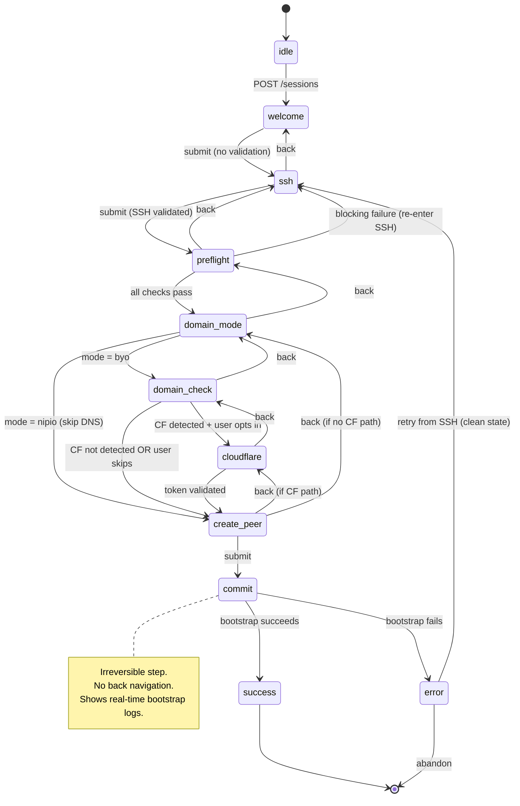

# Wizard State Machine

**Spec**: `specs/006-peer-onboarding/spec.md`
**Created**: 2026-05-28

---

## States

| State | Description | User-visible label |
|-------|-------------|-------------------|
| `idle` | No wizard session exists. Starting point. | — |
| `welcome` | Welcome screen. Prerequisites checklist. | "Welcome" |
| `ssh` | SSH credentials input form. | "Connect to your VPS" |
| `preflight` | Running compatibility checks against VPS. | "Checking your VPS" |
| `domain_mode` | Choose BYO-domain or nip.io. | "Choose your domain" |
| `domain_check` | Validating domain DNS + TLS feasibility. | "Checking your domain" |
| `cloudflare` | Optional: Cloudflare API token input + validation. | "Cloudflare setup" |
| `create_peer` | Name first peer + optional port expose. | "Create your first peer" |
| `commit` | Bootstrap in progress (irreversible). | "Setting up your VPS" |
| `success` | Wizard complete. Show first URL + QR. | "You're connected!" |
| `error` | Unrecoverable error. | "Setup failed" |

---

## State Diagram (Mermaid)



---

## Transitions

| From | To | Trigger | Guard | Persistence |
|------|----|---------|-------|-------------|
| `idle` | `welcome` | `POST /v1/wizard/sessions` | No existing session (409 if exists) | Create `wizard-state.json` |
| `welcome` | `ssh` | `POST /sessions/{id}/steps/welcome` | None (informational step) | Persist `current_step=ssh` |
| `ssh` | `welcome` | Back navigation | None | Persist `current_step=welcome` |
| `ssh` | `preflight` | `POST /sessions/{id}/steps/ssh` | TCP connect + SSH auth + sudo docker ps all pass | Persist `inputs.ssh` + `current_step=preflight` |
| `preflight` | `ssh` | Back navigation | None | Persist `current_step=ssh` |
| `preflight` | `domain_mode` | `POST /sessions/{id}/preflight` | `compatible == true` | Persist `preflight_result` + `current_step=domain_mode` |
| `preflight` | `ssh` | Blocking failure | `compatible == false` | Persist `preflight_result` (don't advance step) |
| `domain_mode` | `preflight` | Back navigation | None | Persist `current_step=preflight` |
| `domain_mode` | `domain_check` | `POST /sessions/{id}/steps/domain_mode` | `mode == "byo"` | Persist `inputs.domain_mode` + `current_step=domain_check` |
| `domain_mode` | `create_peer` | `POST /sessions/{id}/steps/domain_mode` | `mode == "nipio"` | Persist `inputs.domain_mode` + `inputs.nipio_enabled=true` + `current_step=create_peer` |
| `domain_check` | `domain_mode` | Back navigation | None | Persist `current_step=domain_mode` |
| `domain_check` | `cloudflare` | `POST /sessions/{id}/steps/domain_check` | `cloudflare_detected == true` AND `tls_feasible == true` | Persist `domain_check_result` + `current_step=cloudflare` |
| `domain_check` | `create_peer` | `POST /sessions/{id}/steps/domain_check` | `tls_feasible == true` AND (`cloudflare_detected == false` OR user skips CF) | Persist `domain_check_result` + `current_step=create_peer` |
| `domain_check` | `domain_check` | Re-submit | `tls_feasible == false` (show errors, don't advance) | Persist `domain_check_result` (stay on step) |
| `cloudflare` | `domain_check` | Back navigation | None | Persist `current_step=domain_check` |
| `cloudflare` | `create_peer` | `POST /sessions/{id}/steps/cloudflare` | `cloudflare_token_valid == true` | Persist `inputs.cloudflare_token` + `current_step=create_peer` |
| `create_peer` | `cloudflare` | Back navigation | Came from CF path | Persist `current_step=cloudflare` |
| `create_peer` | `domain_mode` | Back navigation | Came from nipio or non-CF path | Persist `current_step=domain_mode` |
| `create_peer` | `commit` | `POST /sessions/{id}/steps/create_peer` | `peer_name` valid, `expose_port` valid (if provided) | Persist `inputs.first_peer_name` + `current_step=commit` |
| `commit` | `success` | `POST /sessions/{id}/commit` | Bootstrap succeeds + peer created + route exposed | Delete `wizard-state.json`. Set `status=committed`. |
| `commit` | `error` | `POST /sessions/{id}/commit` | Bootstrap fails (rollback performed) | Persist `status=error` + error details |
| `error` | `ssh` | Retry | None | Reset `inputs` except SSH coords. Persist `current_step=ssh`. |
| `error` | `idle` | Abandon (`DELETE /sessions/{id}`) | None | Delete `wizard-state.json` |

---

## Persistence Points

State is persisted to `~/.unet/wizard-state.json` at every transition:

```
After:  step submission (success or failure)
After:  preflight result
After:  domain check result
After:  back navigation
After:  commit start (status=in_progress → shows in-progress on resume)
After:  commit success (file deleted)
After:  error (error details stored for retry)
```

**Resume logic**: On `GET /v1/wizard/sessions/{id}`:
1. Load `wizard-state.json`.
2. If `current_step == commit` and `status == in_progress`: **bootstrap was interrupted**. Check VPS health:
   - If healthy: auto-advance to `success` (bootstrap completed before crash).
   - If not healthy: reset to `error` with message "Bootstrap was interrupted. Retry from SSH."
3. If `current_step` is any other step: return current state, client re-renders that step.
4. Re-validate inputs for the current step (SSH connection may have changed, DNS may have propagated).

---

## React Frontend State Machine

The React frontend mirrors the backend state machine via `useReducer`:

```typescript
type WizardStep =
  | 'welcome'
  | 'ssh'
  | 'preflight'
  | 'domain_mode'
  | 'domain_check'
  | 'cloudflare'
  | 'create_peer'
  | 'commit'
  | 'success'
  | 'error';

interface WizardState {
  sessionId: string;
  currentStep: WizardStep;
  inputs: Record<string, unknown>;
  preflightResult: PreflightResult | null;
  domainCheckResult: DomainCheckResult | null;
  loading: boolean;
  error: string | null;
}

type WizardAction =
  | { type: 'SESSION_STARTED'; sessionId: string }
  | { type: 'STEP_COMPLETE'; step: WizardStep; data: Record<string, unknown>; nextStep: WizardStep }
  | { type: 'STEP_ERROR'; step: WizardStep; error: string }
  | { type: 'PREFLIGHT_RESULT'; result: PreflightResult }
  | { type: 'DOMAIN_CHECK_RESULT'; result: DomainCheckResult }
  | { type: 'STEP_BACK'; to: WizardStep }
  | { type: 'RESUME'; state: WizardState }
  | { type: 'COMMIT_STARTED' }
  | { type: 'COMMIT_SUCCESS'; peer: Peer; qr: QRConfig; firstUrl: string }
  | { type: 'COMMIT_FAILURE'; error: string }
  | { type: 'SET_LOADING'; loading: boolean };
```

**Key rules**:
- Frontend NEVER transitions state locally. Every transition goes through the backend API.
- Frontend `currentStep` is always a reflection of the backend's `current_step`.
- Loading states: set `loading: true` before API call, set `loading: false` on response.
- Error states: shown inline on the step component. No global error state.
- Commit step: frontend subscribes to SSE for bootstrap log streaming. Shows real-time progress.

---

## Concurrency Model

- **Single session**: only one wizard session can exist at a time. `POST /v1/wizard/sessions` returns 409 if session already exists.
- **No concurrent step submission**: if a step submission is in progress (e.g., preflight running), subsequent submissions to the same session return 409 `step_in_progress`.
- **Daemon restart**: wizard state survives restart (file-based persistence). On restart, in-progress commit is detected and handled per resume logic above.
- **Browser refresh**: frontend re-fetches session state on mount. No lost progress.
