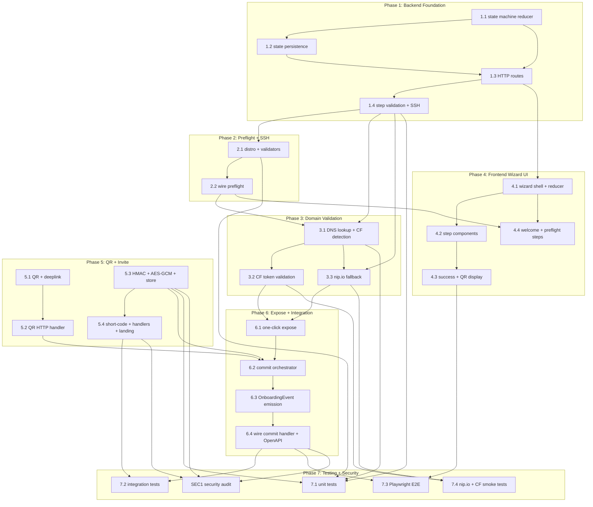

# Tasks: Peer Onboarding Wizard

**Input**: Design documents from `specs/006-peer-onboarding/` (spec.md, plan.md, data-model.md, contracts/)
**Prerequisites**: plan.md (required), spec.md (required), data-model.md (required), contracts/wizard-api.md (required), contracts/invite-protocol.md (required), contracts/qr-deeplink.md (required), contracts/wizard-state-machine.md (required)
**Version**: 1
**Last Updated**: 2026-05-28

**Organization**: Tasks grouped by execution phase. Each task is assigned to a specialist agent. Phases unlock sequentially; tasks within a phase marked `[P]` can run in parallel.

**Dependency Summary**: Backend Foundation (wizard package + state machine + persistence + HTTP routes) → Preflight + SSH validation → Domain validation → Frontend wizard UI → Peer onboarding (QR + invite) → One-click expose + integration → Testing + security audit.

---

## Phase 1: Backend Foundation

**Purpose**: Wizard Go package skeleton, state machine reducer with all transitions from `wizard-state-machine.md`, JSON persistence to `~/.unet/wizard-state.json`, and HTTP route registration on 002's mux. No preflight, no DNS, no QR yet — just the pipe frame.

- [X] **TASK-1.1** [P1] | Agent: backend-specialist | Est: 350 LOC | FR: FR-001, FR-002
**Title**: Create wizard package skeleton with state machine reducer
**Description**: New package `src/internal/wizard/`. Define `WizardStep` enum (11 states from `wizard-state-machine.md`), `WizardState` struct (session_id, current_step, status, inputs, preflight_result, domain_check_result, timestamps), `WizardAction` union type, and pure `Reducer(state, action) → (WizardState, error)` function. All 20+ transitions from the state machine's transition table implemented. Table-driven tests cover every valid + invalid transition.
**Deps**: none
**Acceptance**:
- All transitions from `wizard-state-machine.md` Transitions table produce correct next state
- Invalid transitions (wrong order, skip ahead) return explicit errors
- Back-navigation works for all pre-commit steps
- `commit` and `success` states block back-navigation
- Error state can transition to `ssh` (retry) or `idle` (abandon)
- Reducer is a pure function — no side effects, no I/O

- [X] **TASK-1.2** [P1] | Agent: backend-specialist | Est: 200 LOC | FR: FR-002, FR-007
**Title**: Implement wizard state persistence to `~/.unet/wizard-state.json`
**Description**: `state.go` — `SaveState(dir string, state WizardState) error` and `LoadState(dir string) (*WizardState, error)`. Atomic write (temp file + rename, same pattern as spec 001). File mode 0600. Single-session model: `SaveState` always overwrites. `DeleteState` called on successful commit. On load: validate `session_id` is UUID, `current_step` is valid enum value. Resume logic: if `current_step == commit && status == in_progress`, check VPS health to determine auto-advance to success or reset to error.
**Deps**: TASK-1.1 (state struct + step enum)
**Acceptance**:
- State round-trips through JSON correctly (all fields preserved)
- File created with mode 0600
- Atomic write: no partial files on crash (temp + rename)
- DeleteState removes file
- Corrupted JSON file returns descriptive error, doesn't panic
- Resume logic: `commit/in_progress` + healthy VPS → auto-advance to success
- Resume logic: `commit/in_progress` + unhealthy VPS → reset to error with message

- [X] **TASK-1.3** [P1] | Agent: backend-specialist | Est: 300 LOC | FR: FR-001, FR-002, FR-014
**Title**: Implement wizard session HTTP routes
**Description**: `src/internal/wizard/handlers.go` — HTTP handlers for all 5 wizard API endpoints from `contracts/wizard-api.md`: `POST /v1/wizard/sessions` (start), `GET /v1/wizard/sessions/{id}` (get state), `DELETE /v1/wizard/sessions/{id}` (abandon), `POST /v1/wizard/sessions/{id}/steps/{step}` (submit step), `POST /v1/wizard/sessions/{id}/preflight` (run preflight — stub for now, returns mock result). Route registration function `RegisterRoutes(mux *http.ServeMux)` that 002's `main.go` calls. Single-session enforcement (409 on second start). Step ordering enforcement (409 on out-of-order submission). Auth: loopback bypass, Bearer token for non-loopback.
**Deps**: TASK-1.1, TASK-1.2
**Acceptance**:
- `POST /v1/wizard/sessions` creates state file, returns session with `current_step: welcome`
- Second `POST` returns 409 with existing session info
- `GET` returns full state with redacted sensitive fields
- `DELETE` removes state file, returns 200
- `POST steps/welcome` transitions to `ssh` step
- `POST steps/ssh` with invalid order (before welcome) returns 409
- Step idempotency: re-submit same step with same inputs = no-op
- Loopback request bypasses auth
- Non-loopback without Bearer token returns 401

- [X] **TASK-1.4** [P1] | Agent: backend-specialist | Est: 250 LOC | FR: FR-001
**Title**: Implement step validation dispatch + SSH validator
**Description**: `src/internal/wizard/steps.go` — `validateStep(ctx, step, inputs, state) → (nextStep, error)` dispatch function. Each step has its own validation function. SSH validator (`validateSSH`): uses spec 003's SSH session pool (`internal/ssh/pool.go`) — (a) TCP connect to host:port within 10s, (b) SSH auth (key or password), (c) `sudo docker ps` execution. Returns specific errors: `ssh_connection_refused`, `ssh_auth_failed`, `ssh_no_sudo`, `ssh_no_docker`. Other step validators (welcome, domain_mode, create_peer, cloudflare) validate input structure. Peer name validated against `^[a-zA-Z0-9_-]{1,64}$`.
**Deps**: TASK-1.1 (step enum, action types), spec 003 SSH pool (interface)
**Acceptance**:
- SSH validator returns `ssh_connection_refused` for unreachable host
- SSH validator returns `ssh_auth_failed` for wrong credentials
- SSH validator returns `ssh_no_sudo` when user lacks sudo
- SSH validator returns `ssh_no_docker` (warning, not blocking) when Docker missing
- SSH validator returns `ssh_passphrase_protected` for passphrase-protected keys — error message includes: (1) generate passwordless key: `ssh-keygen -t ed25519 -N ''`, (2) CLI alternative with ssh-agent — link to quickstart §SSH Keys & ssh-agent
- Welcome step validation = no-op (informational)
- Domain mode validation rejects values not in {byo, nipio}
- Create peer validation rejects names not matching `^[a-zA-Z0-9_-]{1,64}$`
- SSH pool injected as interface — mockable in tests

**Checkpoint**: Wizard backend skeleton complete. State machine reducer handles all transitions. State persists to disk. HTTP routes respond correctly. SSH validation works through spec 003's pool. Preflight and domain validation are stubs. Frontend can start wiring UI to these endpoints.

---

## Phase 2: Preflight + SSH

**Purpose**: VPS preflight checks — distro detection, disk/sudo/docker validation, port availability. Runs over SSH after SSH validation passes. All checks return structured `PreflightResult` from `data-model.md`.

- [X] **TASK-2.1** [P1] | Agent: backend-specialist | Est: 300 LOC | FR: FR-003, FR-004
**Title**: Implement distro check + disk/sudo/docker validators
**Description**: New package `src/internal/wizard/preflight/`. `distro.go`: parse `/etc/os-release` over SSH (`cat /etc/os-release`). Extract `ID` and `VERSION_ID`. Accept: Ubuntu ≥ 22.04, Debian ≥ 12. Reject all others with "Unsupported OS: <detected>. Supported: Ubuntu 22.04/24.04, Debian 12." `preflight.go`: `Run(ctx, sshSession) → PreflightResult` orchestrator. Runs: (1) distro check, (2) `df -h /` → disk ≥ 2GB, (3) `sudo -n true` → passwordless sudo, (4) `docker info` → Docker present+running (warn if missing), (5) `ss -tlnp` → ports 443, 80, WG-port free. `PreflightResult` struct matches `data-model.md` exactly.
**Deps**: TASK-1.4 (SSH validator provides live SSH session)
**Acceptance**:
- Ubuntu 22.04, 24.04: `compatible: true`
- Debian 12, 13: `compatible: true`
- CentOS, Fedora, etc: `compatible: false`, `blocking_failures` includes distro message
- Disk < 2GB: blocking failure
- No sudo: blocking failure
- Docker missing: warning (not blocking)
- Docker present but not running: warning
- Port 443 bound by non-unet: blocking failure
- Port 80 bound: warning (BYO HTTP-01 fails, DNS-01 still works)
- All checks run over SSH session, no local exec

- [X] **TASK-2.2** [P1] | Agent: backend-specialist | Est: 150 LOC | FR: FR-004
**Title**: Wire preflight into wizard step handler
**Description**: Replace preflight stub in `handlers.go` with real preflight call. `POST /v1/wizard/sessions/{id}/preflight` now runs `preflight.Run(ctx, sshSession)` using SSH coords from wizard state. Returns full `PreflightResult`. If `compatible == false` with blocking failures → 422 response. If warnings only → 200 with warnings array (client decides to proceed). Persist `preflight_result` in wizard state.
**Deps**: TASK-2.1, TASK-1.3
**Acceptance**:
- Preflight result persisted in wizard state after run
- Blocking failure → 422 with specific error + full preflight result
- Warnings only → 200, client shows confirmation prompt
- Re-running preflight overwrites previous result
- Preflight uses SSH coords from wizard state (no re-prompt)

**Checkpoint**: SSH validation + VPS preflight fully functional. Wizard can validate SSH creds, run compatibility checks, and gate progression based on results. Domain validation and commit still stubs.

---

## Phase 3: Domain Validation

**Purpose**: BYO-domain DNS validation, Cloudflare nameserver detection, token scope validation, nip.io fallback logic. All checks return structured `DomainCheckResult` from `data-model.md`.

- [X] **TASK-3.1** [P1] | Agent: backend-specialist | Est: 250 LOC | FR: FR-005
**Title**: Implement DNS A-record lookup + Cloudflare nameserver detection
**Description**: New package `src/internal/wizard/dnscheck/`. `dnscheck.go`: `Validate(ctx, domain, vpsIP) → DomainCheckResult`. Uses injectable DNS resolver interface (default: `net.LookupHost`, `net.LookupNS`). (1) `LookupHost(domain)` → A-record IPs. Match against VPS IP. (2) `LookupNS(domain)` → check if any NS ends with `.cloudflare.com`. (3) Determine TLS strategy: CF detected + valid token → dns-01, else → http-01. (4) Check http-01 feasibility: port 80 must be free (from preflight). Mismatch → warning with actual A-record value displayed.
**Deps**: TASK-1.4 (step validation), TASK-2.2 (preflight provides port_80_free)
**Acceptance**:
- A-record matches VPS IP: `points_to_vps: true`
- A-record mismatch: `points_to_vps: false`, warning with actual IPs
- No A-record: `a_record_ips: []`, error
- Cloudflare NS detected: `cloudflare_detected: true`
- No Cloudflare: `cloudflare_detected: false`, `tls_strategy: http-01`
- Port 80 blocked + no Cloudflare: `tls_feasible: false`, error
- DNS resolver injected as interface — mockable in tests

- [ ] **TASK-3.2** [P1] | Agent: backend-specialist | Est: 200 LOC | FR: FR-010
**Title**: Implement Cloudflare API token validation + scope check
**Description**: `dnscheck/cloudflare.go`: `ValidateCloudflareToken(ctx, token, domain) → (valid bool, scopes []string, zoneID string, err error)`. Uses `github.com/cloudflare/cloudflare-go`. Validates by: (1) `ListZones` → find domain, (2) attempt DNS record read → verify `DNS:Edit` scope, (3) return detected scopes. Specific errors: `cf_token_invalid`, `cf_token_missing_scope`, `cf_zone_not_found`. Token stored in wizard state (redacted in API responses, stored in state file with 0600 perms).
**Deps**: TASK-3.1 (Cloudflare detection triggers this), `github.com/cloudflare/cloudflare-go` (new dep — needs approval)
**Acceptance**:
- Valid token with Zone:Read + DNS:Edit: `cloudflare_token_valid: true`
- Token with Zone:Read only: `cf_token_missing_scope`, lists missing scopes
- Invalid token: `cf_token_invalid`
- Domain not in CF account: `cf_zone_not_found`
- Cloudflare API client injected as interface — mockable with `httptest`
- Token value never appears in logs (redaction)

- [ ] **TASK-3.3** [P1] | Agent: backend-specialist | Est: 120 LOC | FR: FR-009
**Title**: Implement nip.io fallback resolver + domain mode routing
**Description**: Logic in `wizard/steps.go`. When `domain_mode == nipio`: skip all DNS configuration steps entirely. Auto-generate subdomain pattern: `<label>.<wg-client-ip-dashed>.nip.io`. Check nip.io DNS resolution: if `1-2-3-4.nip.io` fails to resolve, show warning "nip.io DNS unreachable. Proceed without DNS verification or use your own domain." Allow user to continue or switch to BYO-domain. Domain mode router: `domain_mode` step submission dispatches to `domain_check` (BYO) or `create_peer` (nipio) per state machine transitions.
**Deps**: TASK-1.4 (step dispatch), TASK-3.1 (DNS resolver for nip.io check)
**Acceptance**:
- nipio mode: no DNS steps executed, transitions directly to create_peer
- nip.io resolution check: working → proceed, failing → warning + allow continue
- BYO mode: transitions to domain_check step
- Subdomain format correct: `app.10-8-0-2.nip.io`
- nip.io unreachable warning includes option to switch to BYO-domain

**Checkpoint**: Full domain validation pipeline working. BYO-domain with DNS A-record check + Cloudflare detection + token validation. nip.io mode with skip + fallback. All `DomainCheckResult` fields populated correctly. Ready for frontend integration.

---

## Phase 4: Frontend Wizard UI

**Purpose**: React wizard shell with step framework, individual step components, state reducer synced to backend, success page with first URL + QR display. Frontend is a thin reflection of the backend state machine — zero local state transitions.

- [X] **TASK-4.1** [P1] | Agent: frontend-specialist | Est: 400 LOC | FR: FR-001, FR-002, FR-014
**Title**: Build React wizard shell + step framework + useReducer state machine
**Description**: New directory `src/web/wizard/`. `WizardApp.tsx` — root wizard component. `state.ts` — `WizardStep` enum, `WizardState` interface, `WizardAction` discriminated union, `wizardReducer` function (mirrors `wizard-state-machine.md` React section exactly). `api.ts` — typed fetch wrapper for all 5 wizard API endpoints. Step rendering: `currentStep` determines which step component renders. `WizardShell` provides progress bar, back button (disabled after commit), loading spinner, error display. First-run detection: on app load, check `GET /v1/status` → if `vps == null`, redirect to `/wizard`. If `wizard-state.json` exists, `RESUME` action from `GET /v1/wizard/sessions/{id}`.
**Deps**: TASK-1.3 (backend routes must exist)
**Acceptance**:
- Wizard renders welcome step on fresh start
- Progress bar shows correct percentage per step
- Back button navigates to previous step (before commit only)
- API calls dispatch correct actions to reducer
- Resume: browser refresh → state re-fetched → correct step rendered
- First-run: no VPS configured → auto-redirect to /wizard
- Already provisioned: no wizard, normal dashboard
- Loading state shown during API calls
- Error state shown inline on step component

- [ ] **TASK-4.2** [P1] | Agent: frontend-specialist | Est: 350 LOC | FR: FR-001, FR-003, FR-004, FR-005, FR-006
**Title**: Build individual step components (SSH, domain, peer, review)
**Description**: Step components in `src/web/wizard/steps/`. Each component receives current state + dispatch, calls `api.submitStep(step, inputs)`, handles loading/error. `SSHCredentialsStep.tsx` — host, port, user, auth type (key/password), key path or password fields. Validates host:port format client-side. `DomainModeStep.tsx` — BYO vs nipio choice with trade-off explanation (User Story 6). `DomainCheckStep.tsx` — domain input + Cloudflare token field (conditional). Shows A-record result + Cloudflare detection. `CreatePeerStep.tsx` — peer name input + optional first port expose (port number + subdomain). `BootstrapStep.tsx` — shows commit progress, subscribes to SSE for real-time bootstrap logs (via 005's log stream).
**Deps**: TASK-4.1 (wizard shell), TASK-1.3 (step submission API)
**Acceptance**:
- SSH step: form validates host format before submit, shows specific errors from backend
- Domain mode: both options shown with pros/cons, selection dispatches correct mode
- Domain check: A-record result displayed, Cloudflare token field appears conditionally
- Create peer: name validation matches backend regex, port field optional
- Bootstrap step: SSE subscription shows real-time logs, spinner with progress
- Each step shows loading state during API call
- Each step shows inline error on failure
- Back button works on all pre-commit steps

- [ ] **TASK-4.3** [P1] | Agent: frontend-specialist | Est: 200 LOC | FR: FR-001, FR-007
**Title**: Build success page with first URL display + QR + invite link component
**Description**: `SuccessStep.tsx` — displayed after commit succeeds. Shows: (1) first public URL as clickable link (large, prominent), (2) QR code for first peer (calls `POST /v1/peers/{id}/qr` — backend not yet built, mock for now), (3) copyable config text, (4) download .conf button, (5) platform-specific instructions for WG import. `QRDisplay.tsx` — reusable component: renders base64 PNG QR, shows copyable config textarea, download .conf button. `InviteLinkDisplay.tsx` — shows generated invite URL + copy button + short-code display.
**Deps**: TASK-4.2
**Acceptance**:
- Success page displays first public URL prominently
- QR code rendered from base64 PNG data
- Config text copyable to clipboard
- Download .conf triggers file download with correct filename
- Platform instructions shown (Android, iOS, Windows, macOS)
- Invite link display shows URL + short-code (when backend provides them)

- [ ] **TASK-4.4** [P1] | Agent: frontend-specialist | Est: 150 LOC | FR: FR-006, FR-007
**Title**: Build welcome + preflight display step components
**Description**: `WelcomeStep.tsx` — static content: what the wizard does, prerequisites (VPS with SSH access, domain optional), time estimate. No backend call, just "Get Started" button. `PreflightStep.tsx` — auto-triggers preflight on mount (calls `POST /v1/wizard/sessions/{id}/preflight`). Displays results: checkmarks for pass, X for fail, warning icons for warnings. Blocking failures prevent continue. Warnings show confirmation prompt.
**Deps**: TASK-4.1, TASK-2.2 (preflight API must work)
**Acceptance**:
- Welcome: static content rendered, "Get Started" dispatches welcome step
- Preflight: auto-runs on step mount, shows loading spinner during check
- Preflight results: green checkmark for pass, red X for fail, yellow warning for warnings
- Blocking failure: continue button disabled, specific error message
- Warning: continue button shows "Proceed anyway?" confirmation
- Re-run button available to re-check

**Checkpoint**: Full React wizard UI functional. All 8 step components rendered. State synced to backend. Resume works. Success page shows first URL. QR display component ready for backend QR generation. Admin UI auto-redirects to wizard on first run.

---

## Phase 5: Peer Onboarding (QR + Invite)

**Purpose**: QR code generation from WireGuard config, mobile deeplink URI construction, HMAC-signed invite URLs, short-code invite system. Backend packages `src/internal/qr/` and `src/internal/invite/`.

- [ ] **TASK-5.1** [P1] | Agent: backend-specialist | Est: 200 LOC | FR: FR-006, FR-007
**Title**: Implement QR PNG generation + WireGuard deeplink URI builder
**Description**: New package `src/internal/qr/`. `qr.go`: `GeneratePNG(configText string, size int) ([]byte, error)` — uses `github.com/skip2/go-qrcode`. Default size 256×256, error correction M. `deeplink.go`: `BuildDeeplink(configText string) (string, error)` — constructs `wireguard://import?config=<base64url(config)>`. Base64url encoding per RFC 4648 §5, no padding. Returns `QRResult{PNG, DeeplinkURI, ConfigText}`. New dep: `github.com/skip2/go-qrcode` (pure Go, zero CGO).
**Deps**: `github.com/skip2/go-qrcode` (new dep — needs approval)
**Acceptance**:
- QR PNG generated for typical WG config (~500 chars) at 256×256
- QR decodable by standard QR readers (verify with zbarimg or manual scan)
- Deeplink URI: `wireguard://import?config=<valid-base64url>`
- Base64url: no `+`, `/`, or `=` padding characters
- Empty config → error
- Config with special chars (newlines, `=` in keys) encoded correctly

- [ ] **TASK-5.2** [P1] | Agent: backend-specialist | Est: 250 LOC | FR: FR-006, FR-007
**Title**: Implement QR + deeplink HTTP handler for peers
**Description**: `POST /v1/peers/{peerId}/qr` handler. Generates QR PNG + deeplink from peer's stored client config (from 002's peer store). Response matches `contracts/wizard-api.md` QR endpoint: `{peer_id, qr_png_base64, deeplink_uri, config_text, generated_at}`. Config text generated from peer's stored keys + server endpoint + AmneziaWG params. Register route on 002's mux.
**Deps**: TASK-5.1 (QR generation), spec 002 peer store (access peer config)
**Acceptance**:
- Valid peer ID → QR response with base64 PNG + deeplink + config text
- Invalid peer ID → 404
- Config text includes all AmneziaWG params (Jc, Jmin, Jmax, S1-S4, H1-H4, I1-I5)
- QR PNG decodable to correct config text
- Route registered on 002's mux

- [ ] **TASK-5.3** [P1] | Agent: backend-specialist | Est: 350 LOC | FR: FR-012, FR-013
**Title**: Implement HMAC invite link manager + AES-256-GCM config encryption
**Description**: New package `src/internal/invite/`. `invite.go`: `Create(ctx, peerID, mode, ttl, maxUses) → InviteLink`. `hmac.go`: `SignURL(token, peerID, expiresAt, hmacKey) → signature` and `ValidateURL(token, peerID, expiresAt, signature, hmacKey) → bool` with constant-time comparison (`crypto/subtle.ConstantTimeCompare`). `store.go`: invite store — append-only JSONL at `~/.unet/invites.jsonl`, file mode 0600. In-memory index `map[string]int64` (token_hash → file offset). GC on daemon start + hourly: prune expired+consumed invites. Config blob encryption: `AES-256-GCM` with 12-byte nonce (crypto/rand), key = `sha256(daemon_secret)[:32]`. Nonce prepended to ciphertext.
**Deps**: none (pure stdlib crypto)
**Acceptance**:
- HMAC URL generation: URL format matches `contracts/invite-protocol.md`
- HMAC validation: correct signature → valid, tampered signature → 403
- Constant-time comparison: timing test (10k iterations, < 5% variance)
- AES-GCM encrypt/decrypt round-trip correct
- Nonce uniqueness: 10k encryptions, zero nonce collisions
- Invite store: append-only JSONL, file mode 0600
- GC: expired invites pruned, active invites preserved
- In-memory index rebuilt on load from JSONL scan

- [X] **TASK-5.4** [P1] | Agent: backend-specialist | Est: 250 LOC | FR: FR-012, FR-013
**Title**: Implement short-code invite + invite HTTP handlers + landing page
**Description**: `shortcode.go`: `GenerateCode() → (string, error)` — 8-digit numeric code via `crypto/rand`, range 10000000-99999999. Stored as `sha256(code)`. Rate limiting: 5 attempts/IP/60s (in-memory sliding window), 20 total failed attempts per code → invalidate. `handlers.go`: `POST /v1/peers/{peerId}/invite` (create invite), `GET /invite/{peerId}` (validate + serve landing page data), `GET /invite/{peerId}/download` (serve .conf file download). Landing page serves HTML from embedded frontend. OS detection via User-Agent → WG client download links.
**Deps**: TASK-5.3 (invite store + HMAC), TASK-1.3 (route registration pattern)
**Acceptance**:
- Short-code: 8 digits, no code < 10000000
- Rate limit: 6th request in 60s → 429 with Retry-After
- 21st failed attempt per code → 410 invite_consumed
- Create invite (HMAC mode): returns URL with t, e, s params
- Create invite (short-code mode): returns code (plaintext, shown once)
- Landing page: valid invite → QR + config + download link + OS detection
- Landing page: expired → 410, consumed → 410, bad sig → 403
- Download: returns .conf file with correct filename + Content-Type

**Checkpoint**: Full peer onboarding pipeline. QR codes generated server-side. HMAC invite links with constant-time validation. Short-code invites with rate limiting. Landing page serves config with OS detection. All invite security properties (AES-GCM encryption, one-time consumption, TTL enforcement) implemented.

---

## Phase 6: One-Click Expose + Integration

**Purpose**: One-click port exposure endpoint, bootstrap commit orchestration (calls 003), in-process peer creation (calls 002), OnboardingEvent emission (calls 005). This phase wires the wizard's commit step into existing subsystems.

- [ ] **TASK-6.1** [P1] | Agent: backend-specialist | Est: 300 LOC | FR: FR-008, FR-009
**Title**: Implement one-click port expose endpoint + atomic route+DNS creation
**Description**: `POST /v1/routes/expose` handler. Flow: (1) validate subdomain availability (check Caddy routes + existing DNS), (2) call `POST /v1/routes` internally (in-process handler call to spec 002), (3) if Cloudflare mode: create DNS A-record via `cloudflare-go`, (4) return public URL. Auto-subdomain: `svc-<random-4>.<domain>` for BYO, `svc-<random-4>.<wg-ip-dashed>.nip.io` for nipio. Atomic: if DNS creation fails after route creation, rollback route (delete). Conflict detection: subdomain already in Caddy config → 409 `route_conflict` with suggested alternative.
**Deps**: TASK-3.2 (Cloudflare integration for DNS), TASK-3.3 (nip.io subdomain format), spec 002 route handler
**Acceptance**:
- Valid expose: route + DNS created, URL returned within 3s
- Subdomain conflict → 409 with suggested alternative
- Cloudflare DNS failure → route rolled back, clean state
- Auto-subdomain format: `svc-ab12.example.com` (BYO) or `svc-ab12.10-8-0-2.nip.io` (nipio)
- nipio mode: no DNS record created (nip.io resolves automatically)
- Route creation uses in-process call (not HTTP loopback)

- [ ] **TASK-6.2** [P1] | Agent: backend-specialist | Est: 350 LOC | FR: FR-001, FR-011
**Title**: Implement wizard commit orchestrator (bootstrap + peer + expose + cleanup)
**Description**: `src/internal/wizard/commit.go`. `CommitSession(ctx, state) → CommitResult`. Orchestrates the irreversible bootstrap sequence: (1) call `bootstrap.Bootstrap(ctx, sshCoords, opts)` from spec 003's `internal/lifecycle/bootstrap/`, (2) wait for health probe success, (3) create first peer via in-process call to 002's peer handler, (4) generate QR via `qr.Generate`, (5) if user specified first port expose: call one-click expose (TASK-6.1), (6) delete `wizard-state.json`, (7) emit `wizard.commit_success` event. On failure: rollback is handled by spec 003 bootstrapper (idempotent), set `status: error` in state. Long-running (2-5 min): SSE progress streaming via 005's log pipeline.
**Deps**: TASK-1.3 (commit handler), TASK-5.1 (QR generation), TASK-6.1 (expose), spec 003 bootstrap, spec 002 peer handler
**Acceptance**:
- Successful commit: VPS bootstrapped, peer created, QR generated, first URL returned
- Bootstrap failure: rollback performed, VPS in clean state, error stored
- Wizard state file deleted on success
- OnboardingEvent emitted at each stage (commit_start, commit_success/commit_failure)
- Duration tracked: bootstrap_duration_ms, total_duration_ms
- Idempotent: re-running commit on already-bootstrapped VPS = no-op

- [ ] **TASK-6.3** [P1] | Agent: backend-specialist | Est: 150 LOC | FR: FR-001
**Title**: Wire OnboardingEvent emission into 005's log pipeline
**Description**: At each wizard step transition + commit, emit structured `OnboardingEvent` via `slog.Info("wizard.step_complete", "event", OnboardingEvent{...})`. Events flow through 005's unified log pipeline (`slog` handler → ring buffer → SSE stream). Events tagged `component: "wizard"`, `source: "onboarding"`. Event types: `step_complete`, `step_error`, `preflight_result`, `domain_check_result`, `commit_start`, `commit_success`, `commit_failure`, `peer_created`, `invite_created`, `invite_consumed`. Audit log entry on commit: action `wizard_complete` with metadata.
**Deps**: TASK-6.2 (commit orchestrator), spec 005 slog pipeline
**Acceptance**:
- Each step transition emits OnboardingEvent with correct event_type
- Events appear in 005's log stream (queryable via SSE with component=wizard filter)
- Commit success emits `commit_success` with duration + first URL
- Commit failure emits `commit_failure` with error + rollback status
- Audit trail entry created on wizard completion
- Events queryable via `GET /v1/logs/stream?component=wizard`

- [X] **TASK-6.4** [P1] | Agent: backend-specialist | Est: 100 LOC | FR: FR-001
**Title**: Wire wizard commit handler to real backend + 002 OpenAPI contract update
**Description**: Replace commit handler stub with `CommitSession` call. Wire `POST /v1/wizard/sessions/{id}/commit` to invoke commit orchestrator. Update spec 002's OpenAPI contract (`contracts/api.openapi.yaml`) to document new endpoints: `/v1/wizard/*`, `/v1/peers/{id}/qr`, `/v1/peers/{id}/invite`, `/v1/routes/expose`. This is a documentation-only change to 002's contract.
**Deps**: TASK-6.2, TASK-6.3
**Acceptance**:
- Commit handler invokes real bootstrap + peer creation + QR generation
- 002 OpenAPI yaml updated with all new wizard endpoints
- Commit endpoint returns full result (peer, QR, first URL, durations)
- Long-running commit streams progress via SSE

**Checkpoint**: Full integration complete. Wizard commit bootstraps VPS, creates peer, generates QR, exposes first URL. All subsystems wired (003 bootstrap, 002 peer/route, 005 events). One-click port exposure works atomically with DNS rollback. OpenAPI contract up to date.

---

## Phase 7: Testing + Security Audit

**Purpose**: Unit tests for state machine, validators, HMAC. Integration tests for wizard E2E + Cloudflare. Playwright E2E. Security audit. nip.io smoke test. Validation phase — everything gets exercised.

- [X] **TASK-7.1** [P1] | Agent: test-engineer | Est: 400 LOC | FR: FR-001-FR-014
**Title**: Write unit tests for wizard state machine, validators, HMAC, invite store
**Description**: `wizard/wizard_test.go`: table-driven tests for every state transition (valid + invalid). `wizard/state_test.go`: persistence round-trip, resume logic, corrupted file handling. `wizard/preflight/preflight_test.go`: table-driven os-release parsing → pass/fail. `wizard/dnscheck/dnscheck_test.go`: mock DNS resolver, A-record match/mismatch, Cloudflare detection. `invite/hmac_test.go`: sign → validate → consume round-trip, constant-time verification. `invite/shortcode_test.go`: 8-digit generation, no collisions in 10k, rate limit enforcement. `invite/store_test.go`: append + GC + index rebuild. All tests use `t.TempDir()`, mock interfaces, `go test -race`.
**Deps**: TASK-1.1, TASK-1.2, TASK-1.4, TASK-2.1, TASK-3.1, TASK-5.3
**Acceptance**:
- State machine: all 20+ transitions tested, invalid transitions return errors
- Preflight: Ubuntu/Debian pass, CentOS fail, disk/sudo/docker checks
- DNS check: A-record match/mismatch, CF detection, TLS strategy determination
- HMAC: sign-validate round-trip, tampered sig rejected, expired rejected
- Short-code: rate limit enforced (5/min), 21st fail → invalidate
- Invite store: append + GC + index rebuild correct
- All tests pass with `go test -race ./internal/wizard/... ./internal/invite/...`
- Coverage > 80% for wizard/ and invite/ packages

- [X] **TASK-7.2** [P1] | Agent: test-engineer | Est: 500 LOC | FR: FR-001-FR-014
**Title**: Write integration tests for full wizard flow + invite lifecycle + one-click expose
**Description**: Integration tests using `httptest.Server` with real wizard handlers + mock SSH/bootstrap. Tests: (1) Full wizard flow: create session → submit welcome → submit SSH (mock) → preflight (mock) → domain mode → domain check (mock DNS) → create peer → commit (mock bootstrap) → verify success response. (2) Invite lifecycle: create peer → create invite (HMAC) → consume invite → verify consumed. Create invite (short-code) → enter code → verify config. Expired invite → 410. Consumed invite → 410. Rate limited → 429. (3) One-click expose: expose port → verify route created → expose same subdomain → 409 conflict. Cloudflare DNS mock: success + failure + rollback. (4) Wizard resume: interrupt at SSH step → reload → resume from SSH with pre-filled data.
**Deps**: TASK-6.4 (all handlers wired), TASK-5.4 (invite handlers)
**Acceptance**:
- Full wizard flow: 8 steps completed end-to-end with mocked SSH/bootstrap
- Invite HMAC lifecycle: create → consume → second consume fails
- Invite short-code lifecycle: create → enter code → config displayed → rate limit
- One-click expose: route created, conflict detected, DNS rollback
- Resume: state restored, inputs pre-filled, correct step rendered
- All tests use temp dirs, no real ~/.unet
- Coverage > 70% for handler layer

- [X] **TASK-7.3** [P2] | Agent: test-engineer | Est: 400 LOC | FR: FR-001, FR-006, FR-012
**Title**: Write Playwright E2E tests for wizard + QR + invite
**Description**: Playwright tests against running daemon with mock SSH. Tests: (1) Happy path: fresh admin UI → complete wizard → verify first URL displayed → verify QR rendered. (2) Interrupt + resume: complete through SSH step → close browser → reopen → resume from domain step. (3) QR flow: create peer → verify QR displayed → verify config text matches WG format. (4) Invite link: generate invite → open in new browser → verify config displayed → verify consumed on second visit. (5) One-click expose: expose port 3000 → verify URL displayed. (6) nip.io smoke: select nip.io mode → verify no DNS steps → verify auto-subdomain format.
**Deps**: TASK-6.4 (full integration), TASK-4.1-TASK-4.4 (frontend)
**Acceptance**:
- Happy path: wizard completes, first URL shown, QR rendered
- Resume: correct step shown after browser restart
- QR: config text matches expected WG format with AmneziaWG params
- Invite: config displayed once, consumed on second visit
- Expose: URL returned, route created
- nip.io: no DNS steps, auto-subdomain correct
- All tests run in CI (headless Playwright)

- [X] **TASK-7.4** [P2] | Agent: test-engineer | Est: 150 LOC | FR: FR-009
**Title**: Write nip.io smoke test + Cloudflare mock test zone validation
**Description**: `preflight/nipio_test.go`: test nip.io subdomain resolution against live nip.io DNS (skip in CI if network unavailable). Verify `10-8-0-2.nip.io` resolves to `10.8.0.2`. Test unreachable fallback. `dnscheck/cloudflare_test.go`: `httptest` mock of Cloudflare API. Test token validation with various scope combinations. Test zone-not-found. Test DNS record read for scope verification. Test error responses match contract.
**Deps**: TASK-3.2 (Cloudflare integration), TASK-3.3 (nip.io resolver)
**Acceptance**:
- nip.io resolution: known IP resolves correctly
- nip.io unreachable: fallback warning generated
- CF mock: valid token + correct scopes → pass
- CF mock: missing DNS:Edit → specific error
- CF mock: invalid token → cf_token_invalid
- CF mock: domain not in account → cf_zone_not_found
- Network-dependent tests skip gracefully in offline CI

- [ ] **TASK-SEC1** [P1] | Agent: security-auditor | Est: 200 LOC | FR: FR-005, FR-012, FR-013
**Title**: Holistic security audit of peer onboarding subsystem
**Description**: Comprehensive security review covering: (1) HMAC timing-attack resistance — verify `crypto/subtle.ConstantTimeCompare` used everywhere signatures are compared, measure timing variance over 10k iterations. (2) Invite URL leak vectors — check browser history, referrer headers, server logs for token exposure. Verify encrypted config blob, not raw WG config. (3) AES-256-GCM correctness — verify nonce uniqueness, key derivation from daemon secret, no key reuse. (4) File permissions — `wizard-state.json` 0600, `invites.jsonl` 0600, config.json 0600. Verify via `os.Stat` in tests. (5) Secret redaction — grep daemon source for peer.PrivateKey, token.Plaintext, config_text in log statements. Zero hits. (6) Short-code brute-force resistance — verify rate limiting (5/IP/min, 20 max fails), code entropy analysis. (7) Invite consumption race condition — verify single-writer JSONL prevents double-consume. Produces findings document at `specs/006-peer-onboarding/reviews/security-audit.md`.
**Deps**: TASK-5.3 (HMAC + AES-GCM), TASK-5.4 (invite handlers), TASK-6.4 (full integration)
**Acceptance**:
- HMAC timing test: < 5% variance between valid and invalid signature check times
- No raw WG config in any URL, log, or error message
- AES-GCM: 10k encryptions, zero nonce collisions verified
- All file perms verified 0600 via syscall stat
- Secret-leak grep returns zero hits (peer keys, tokens, config_text)
- Short-code rate limit verified: 6th request blocked, 21st fail invalidates
- Findings written to `specs/006-peer-onboarding/reviews/security-audit.md`
- No critical/high severity findings unresolved

**Checkpoint**: All tests passing. Security audit complete with findings documented. Full wizard E2E verified via Playwright. Integration tests cover all flows. Unit tests cover all pure logic. Ready for cross-AI review per Constitution Principle VI.

---

## Dependency Graph

```
Phase 1 (Backend Foundation)
  TASK-1.1 ─────┐
  TASK-1.2 ─────┤
  TASK-1.3 ─────┼──→ TASK-1.4 ──┬──→ Phase 2 ──→ TASK-2.1 ──→ TASK-2.2
  TASK-1.1+1.2 ─┘               │
                                 ├──→ Phase 3 ──→ TASK-3.1 ──→ TASK-3.2
                                 │                TASK-3.3
                                 │
                                 ├──→ Phase 4 ──→ TASK-4.1 ──→ TASK-4.2 ──→ TASK-4.3
                                 │                TASK-4.4 (after 4.1 + 2.2)
                                 │
                                 ├──→ Phase 5 ──→ TASK-5.1 ──→ TASK-5.2
                                 │                TASK-5.3 ──→ TASK-5.4
                                 │
                                 └──→ Phase 6 ──→ TASK-6.1 ──→ TASK-6.2 ──→ TASK-6.3 ──→ TASK-6.4

Phase 7 (Testing)
  TASK-7.1 (after P1-P3 + P5)
  TASK-7.2 (after P6)
  TASK-7.3 (after P4 + P6)
  TASK-7.4 (after P3)
  TASK-SEC1 (after P5 + P6)
```

### Mermaid DAG



### Critical Path

**Length**: 9 tasks

```
TASK-1.1 → TASK-1.3 → TASK-1.4 → TASK-2.1 → TASK-2.2 → TASK-3.1 → TASK-6.1 → TASK-6.2 → TASK-6.4
```

SSH validation chain is the critical path: reducer → routes → SSH validator → preflight → DNS check → expose → commit orchestrator → wire handler. The commit step depends on the longest sequential chain of validated prerequisites.

### Parallel Lanes

| Lane | Tasks | Can run parallel with |
|------|-------|-----------------------|
| P1 foundation | TASK-1.1→1.4 (sequential within) | — |
| P2 preflight | TASK-2.1→2.2 | P5.1 (QR generation, no deps) |
| P3 domain | TASK-3.1→3.2, TASK-3.3 (parallel) | P4, P5 |
| P4 frontend | TASK-4.1→4.4 (sequential) | P2 (after 1.3), P3, P5 |
| P5 QR+invite | TASK-5.1→5.2, TASK-5.3→5.4 (two parallel chains) | P2, P3, P4 |
| P6 integration | TASK-6.1→6.4 (sequential) | P7.1 (unit tests start early) |
| P7 testing | TASK-7.1 (after P1-P3+P5), TASK-7.2 (after P6) | — |

**Max parallelism**: After P1.3 (routes), P4 frontend and P5 QR can start immediately. P2 preflight and P3 domain are sequential (preflight provides SSH session for domain checks). P5.3 (HMAC/AES) has zero backend deps — can start immediately.

---

## Coverage Validation

### FRs Covered: 14/14

| FR | Task(s) |
|----|---------|
| FR-001 (wizard flow + step validation) | TASK-1.1, 1.3, 1.4, 4.1, 4.2, 6.2 |
| FR-002 (state persistence + resume) | TASK-1.2, 4.1 |
| FR-003 (SSH validation) | TASK-1.4 |
| FR-004 (VPS preflight) | TASK-2.1, 2.2 |
| FR-005 (domain validation) | TASK-3.1, 3.2 |
| FR-006 (QR code generation) | TASK-5.1, 5.2, 4.3 |
| FR-007 (QR + copyable + download) | TASK-4.3, 5.2 |
| FR-008 (one-click expose) | TASK-6.1 |
| FR-009 (nip.io auto-subdomain) | TASK-3.3, 6.1 |
| FR-010 (Cloudflare DNS-01) | TASK-3.2 |
| FR-011 (peer creation auto-keys) | TASK-6.2 (reuses 002) |
| FR-012 (invite links HMAC) | TASK-5.3, 5.4 |
| FR-013 (invite landing page) | TASK-5.4 |
| FR-014 (wizard undo/back-nav) | TASK-1.1, 4.1 |

### Components from Plan: 10/10

| Component | Task(s) |
|-----------|---------|
| 1. WizardOrchestrator | TASK-1.1, 1.3, 1.4, 6.2 |
| 2. SSHValidator | TASK-1.4 |
| 3. DistroPreflight | TASK-2.1 |
| 4. DomainValidator | TASK-3.1, 3.2 |
| 5. CloudflareIntegrator | TASK-3.2 |
| 6. NipIoFallback | TASK-3.3 |
| 7. QRGenerator | TASK-5.1, 5.2 |
| 8. InviteLinkManager | TASK-5.3, 5.4 |
| 9. OneClickPublisher | TASK-6.1 |
| 10. WizardUI | TASK-4.1, 4.2, 4.3, 4.4 |

### Entities: 6/6

| Entity | Task(s) |
|--------|---------|
| WizardState | TASK-1.1 (struct), TASK-1.2 (persistence) |
| PreflightResult | TASK-2.1 (generation), TASK-2.2 (persistence in state) |
| DomainCheckResult | TASK-3.1 (generation), TASK-3.2 (CF fields) |
| InviteLink | TASK-5.3 (creation + store), TASK-5.4 (handlers) |
| OnboardingEvent | TASK-6.3 (emission) |
| QRConfig | TASK-5.1 (generation), TASK-5.2 (HTTP response) |

### Endpoints: 11/11

> **Note**: 11 endpoints = 8 from `contracts/wizard-api.md` core wizard surface + 3 discovered during decomposition (invite landing `GET /invite/{peerId}`, config download `GET /invite/{peerId}/download`, one-click publish `POST /v1/routes/expose`). All documented in appropriate task acceptance criteria.

|| Endpoint | Task(s) | Discovered? |
|----------|---------|-------------|
| `POST /v1/wizard/sessions` | TASK-1.3 | — |
| `GET /v1/wizard/sessions/{id}` | TASK-1.3 | — |
| `DELETE /v1/wizard/sessions/{id}` | TASK-1.3 | — |
| `POST /v1/wizard/sessions/{id}/steps/{step}` | TASK-1.3, 1.4 | — |
| `POST /v1/wizard/sessions/{id}/preflight` | TASK-2.2 | — |
| `POST /v1/wizard/sessions/{id}/commit` | TASK-6.4 | — |
| `POST /v1/peers/{peerId}/qr` | TASK-5.2 | — |
| `POST /v1/peers/{peerId}/invite` | TASK-5.4 | — |
| `GET /invite/{peerId}` | TASK-5.4 | invite landing — user opens invite link |
| `GET /invite/{peerId}/download` | TASK-5.4 | config download — fallback when WG app not installed |
| `POST /v1/routes/expose` | TASK-6.1 | one-click publish — atomic route+DNS creation |

### Beyond-Spec Decisions: 7/7

| Decision | Reflected In |
|----------|-------------|
| useReducer over xstate | TASK-4.1 (React useReducer) |
| skip2/go-qrcode for QR | TASK-5.1 (library choice) |
| Single wizard session model | TASK-1.3 (409 on second start) |
| Plain JSON + 0600 for wizard state | TASK-1.2 (no age encryption) |
| In-process peer/route creation | TASK-6.2 (function call, not HTTP) |
| AES-256-GCM encrypted invite blobs | TASK-5.3 (encrypted store) |
| Short-code rate limit 5/IP/min + 20 max | TASK-5.4 (rate limiting) |

### Open Risks Mitigated: 8/8

| Risk | Mitigation Task |
|------|----------------|
| 1. SSH passphrase-protected keys | TASK-1.4 (detect passphrase-protected keys → clear error + CLI redirect to quickstart §SSH Keys & ssh-agent) |
| 2. Cloudflare token scope errors | TASK-3.2 (specific error messages) |
| 3. Mobile WG deeplink fragmentation | TASK-4.3 (fallback .conf + instructions) |
| 4. Invite link leak via URL | TASK-SEC1 (audit), TASK-5.3 (encrypted blob, no raw config) |
| 5. nip.io LE rate limits | TASK-3.3 (document dev-only use) |
| 6. Wizard partial state encryption | TASK-1.2 (plain JSON + 0600, no keys in state) |
| 7. Bootstrap duration UX | TASK-6.2 (SSE progress streaming) |
| 8. Port 80 availability | TASK-2.1 (preflight check + warning) |

---

## Task Summary

### By Phase

| Phase | Tasks | Est LOC |
|-------|-------|---------|
| 1. Backend Foundation | 4 (TASK-1.1 → 1.4) | ~1100 |
| 2. Preflight + SSH | 2 (TASK-2.1 → 2.2) | ~450 |
| 3. Domain Validation | 3 (TASK-3.1 → 3.3) | ~570 |
| 4. Frontend Wizard UI | 4 (TASK-4.1 → 4.4) | ~1100 |
| 5. QR + Invite | 4 (TASK-5.1 → 5.4) | ~1050 |
| 6. Expose + Integration | 4 (TASK-6.1 → 6.4) | ~900 |
| 7. Testing + Security | 5 (TASK-7.1 → 7.4, TASK-SEC1) | ~1650 |
| **Total** | **26** | **~6820** |

### By Agent

| Agent | Tasks |
|-------|-------|
| backend-specialist | 17 (TASK-1.1→1.4, 2.1→2.2, 3.1→3.3, 5.1→5.4, 6.1→6.4) |
| frontend-specialist | 4 (TASK-4.1→4.4) |
| test-engineer | 4 (TASK-7.1→7.4) |
| security-auditor | 1 (TASK-SEC1: HMAC timing, invite leak, AES-GCM, file perms) |

### Parallel-Eligible

- Phase 1: TASK-1.1 → 1.2 → 1.3 → 1.4 (sequential within phase)
- Phase 2 vs Phase 5: TASK-2.x and TASK-5.x can run in parallel (no deps between them)
- Phase 3: TASK-3.2 and TASK-3.3 can start once TASK-3.1 completes
- Phase 4 vs Phase 3 vs Phase 5: all can run in parallel after Phase 1
- Phase 5: TASK-5.1→5.2 (QR chain) and TASK-5.3→5.4 (invite chain) run in parallel
- Phase 7: TASK-7.1 can start after Phase 3 + Phase 5 (no need to wait for P6)

### Cycles: no
### Deepest chain: 9 levels (1.1 → 1.3 → 1.4 → 2.1 → 2.2 → 3.1 → 6.1 → 6.2 → 6.4)
